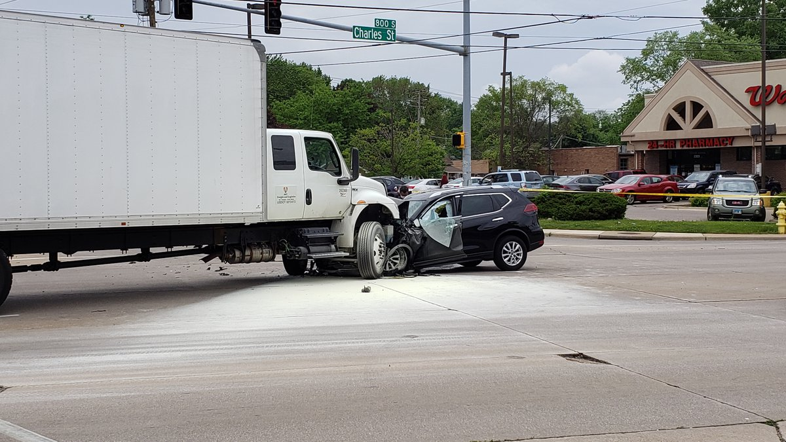



## Foreword

When it comes to safety of autonomous vehicles (AV), we as a society often claim that such a system must be safer as an average human driver.
To validate this requirement, the industry pushes metrics such as accident-free travelled distance, expecting to cover the most critical situations an AV would face.

Unfortunately, the amount of driven distance required to statistically prove the safety of such a system is in the order of 6 billion km [1]. 
Even if we reduce the number of (quite expensive) real world tests to a minimum with simulated drives, the process of validating a new software version is still extremely challenging.
The simulation process must cover a high number of random routes in a simulated world at different weather and traffic conditions.
Just imagine the effort of modelling a whole city with its traffic network, vegetation, and traffic participants (Grand Theft Auto anyone?).

Thus, the industry takes a more focussed approach with **scenario-based testing** where the task of driving is separated in smaller chunks such as *entering the road*, 
*driving straight*, *changing lanes* or *turning right in an intersection*. Having all the scenarios simulated in various conditions, 
the industry hopes to reach the goal of a perfectly safe system. Of course, in those short chunks of driving, for the maximum of realism, 
you still need to model the environment around the scenario, but the effort of modelling an entire city is avoided.

A valid criticism to the scenario-based approach is the question whether the scenario catalogue (i.e. set of scenarios) 
maintained the developers or regulators will cover all critical situations where an AV could fail. 
To address this concern those catalogues are extended with situations from accidents observed in the past. 
In a manual manner, the AV developers carefully describe the accident in a machine readable format digestible by the simulation tooling.

This blog post will cover an additional source of crucial scenarios from the NHTSA’s crash data collection program – the Crash Investigation Sampling System (CISS). We will explore a method to make the accidents usable in simulation.

The fundamental motivation for us is:

> An autonomous system behaving well on those critical events shall bring us closer to the safety goal.

Across the next sections we will quickly go over the information available in the above mentioned data source. 
From the scene diagrams we will extract the trajectories (position over time) of all actors involved which then can be used for simulation.

## Using NHTSA accidents to improve safety

A few words about the organization behind the data we will use:

> The National Highway Traffic Safety Administration (NHTSA), [...], under the U.S. Department of Transportation, 
> is responsible for reducing deaths, injuries and economic losses resulting from motor vehicle crashes.
> This is accomplished by setting and enforcing safety performance standards for motor vehicles and motor vehicle equipment,
> and through grants to state and local governments to enable them to conduct effective local highway safety programs.[2]

The database consists of **11358 highway accidents** involving human injuries. It may be helpful to understand the 
process of "sampling" the data. The following paragraph is taken from the official website hosted by NHTSA:

> After a crash has been sampled, trained Crash Technicians obtain data from crash sites by documenting scene evidence such as *skid marks*, fluid spills, and struck objects. They locate the *vehicles* involved, document the crash damage, and identify interior components that were contacted by the occupants. On-site inspections are followed-up with confidential interviews of the crash victims and a review of medical records for injuries sustained in the crash. *[...]*
> 
>  Personal information such as names, addresses, license and registration numbers, and even specific crash locations are not included in public CISS files.

Each accident is visualized in a *scene diagram*. The diagram shows the traffic participants at multiple points in time throughout the scenario from bird's eye view.



In addition to the diagram, NHTSA provides additional information about injuries, vehicle models, datetime etc. on their Crash Viewer:


Given the scene diagram and surrounding meta data from the database, our task is to extract realistic trajectories usable in simulation.

## Methodology

In a nutshell the process of extracting trajectories has the following steps:

1.	Extract vehicle shapes and labels from scene diagram
2.	Associate shapes to actual vehicles (i.e. assign vehicle IDs to extracted shapes)
3.	For each vehicle, order the shape positions by time of occurrence to obtain waypoints
4.	For each vehicle and its waypoints, generate a realistic (i.e. physically feasible) trajectory

In the consecutive paragraphs we will go over each step and spend some light on each of them.

### Step 1: Extracting vehicle shapes from the diagram

The scene diagram is provided in two formats: `PDF` and proprietary `BLZ` (FARO® Blitz software). The latter can be opened in every text editor and parsed as an XML:

```xml
<arasblitzscene>
    <data fileversion="1.0" exeversion="1.0.0.10" />
    <canvas clr="255,255,255,255" panX="-155.7646" panY="6.393857" />
    <grid gclrclr="255,135,206,235" aclrclr="255,255,0,0" space="10" t="0" axisv="F" v="F" lclr="F" pX="0" pY="0" sizeX="2008.265" sizeY="1197.521" />
    <scene posX="0" posY="0" theta="0" scalex="1" scaley="1">
    <layers count="2" activendx="1">
        <layer name="Default" visible="T" locked="F" paint="F" posX="0" posY="0" theta="0" scale="1" lnclr="255,0,0,0" fillclr="255,0,0,0">
            <items count="64">
                <item type="poly-curve" clrclr="255,0,0,0" fclrclr="255,169,169,169" ds="0" ulclr="F" fill="F" close="F" ssa="F" sea="F" fc="T" as="1" tds="1" tdt="0" tdc="F" tdOC="F" tdOS="0" tdOO="0" tdDT="0.5" tdDL="10" tdDS="25" tdST="0" tdCF="T" tdCR="0.01" tdCW="0.35">
                    <pnt X="337.6161" Y="-279.2642" />
                    <pnt X="58.80255" Y="102.7296" />
                    <pnt X="-59.16676" Y="264.2328" />
                    <pnt X="-233.6886" Y="503.7234" />
                    </item>
                <item type="GuardRail" v="T" pc="F" ulc="F" lo="1" pr="1" ps="10" pntl="2" pntd="/CPFQnzUakLq0XvBylFYQw==" mlclr="255,176,196,222" mdclr="255,128,64,0" ds="0.25" dt="0" dc="F" dOC="F" dOS="0" dOO="0" dDT="1" dDL="1" dDS="10" dST="1" dCF="F" dCR="0.1" dCW="0.35" />
                <item type="gosmodel" name="SILVERADO 1500 CREW CAB S/BOX 4X4" dmgIdx="-1" agr="F" lclr="F" vis="T" hwb="T" t="2.150799" pX="45.50632" pY="71.68256" sX="18.70079" sY="6.660105" bsX="18.1124" bsY="6.504802" matFclr="255,192,192,192" matLclr="255,0,0,0"><!-- ... --></item>
                <item type="label" round="F" fill="F" borderVis="F" vis="T" lClr="F" arrow="F" ds="F" border="0" arrowS="1" pW="0" sX="0.5" sY="0.5" theta="0" clrB="255,255,255,255" clrL="255,0,0,0" arrowStart="2" posX="175.101" posY="-6.71208" dimX="26.32889" dimY="19.88727" arrowEndX="NaN" arrowEndY="0" padX="0" padY="0">
                    <text type="textp" lclr="F" vis="T" t="0" s="4" posX="166.5719" posY="-3.942969" dimX="26.32889" dimY="19.88727" matclr="255,0,0,0" txt="Event 1" fFN="Arial" fSize="3.343832" fStyle="0" txtSW="17.05804" txtSH="5.53822" alignV="1" alignH="1" />
                    </item>
                <!-- more items ... -->
```

Usually, the vehicles are denoted as items of `type="gosmodel"`, the (human) annotations such as *Event 1* are encoded as `type="label"` and the road markings are of `type="poly-curve"`.

Both the vehicles and annotation elements can be represented as a rectangle:

- sizes in X and Y direction: `sX`, `sY`
- heading angle `t` in radians.

The parsing logic is implemented and available [on GitHub](https://github.com/kopytjuk/nhtsa-ciss-python).

### Step 2: Associate shapes to actual vehicles

Having represented vehicles and annotation as rectangles, we can easily pair them by checking the intersection.
This can be efficiently implemented via `shapely`'s `intersection()` method (refer to [docs](https://shapely.readthedocs.io/en/stable/manual.html#object.intersection)).

For shapes without a label on top (this issue is true in some diagrams, like the truck in the center of diagram), 
a human has to intervene and add the corresponding pairing manually. For simplicity this pairing is done in a tiny excel table, where we set some assignments to `TRUE` or `FALSE`:



### Step 3: Order waypoints by occurrence

Next, having the vehicle locations in the diagram we will order them in time. The task is relatively straightforward for us humans,
since we see the direction of the road, we see where the collision happened and can easily imagine the temporal order of events (from bottom right to top left).

However, this ordering shall be done in automated manner. Note that since the diagrams were created (drawn) by human technicians, 
there is no sequence numbering included in the `.blz` file which we could use.

If we formulate the ordering problem as a **graph** with:
- vehicle positions as vertices and 
- the [*energy*](https://en.wikipedia.org/wiki/Energy) needed to transition between position as edges
  
we can use algorithms solving the [Travelling Salesman Problem](https://en.wikipedia.org/wiki/Travelling_salesman_problem) to find the right order:

> The travelling salesman problem (TSP) asks the following question: *Given a list of cities and the distances between each pair of cities, what is the shortest possible route that visits each city exactly once [...]?*"

The TSP solution will lead us to the most energy efficient (and thus most likely the actual) order of vehicle locations.

The following image shall provide a small example of the *energy graph*:



For the rest of this post I will use the term *waypoints* to refer to the ordered list of vehicle locations.

*> In case you are not interested in the implementation details, feel free to jump straight to Step 4!*

-----

Now we will elaborate a little on the energy computation and the TSP implementation details.

Note, that the distance alone is not the only factor for the required energy. To accomplish `A ← B` you have to decelerate to full stop (i.e. spend energy) and drive reverse. 
Alternatively, you need to drive a circle to come back. Driving from `A → B` however needs far less energy – 
the vehicle solely faces [air resistance](https://en.wikipedia.org/wiki/Drag_(physics)) 
and [road friction](https://en.wikipedia.org/wiki/Rolling_resistance) (which is needed for the former case, of course).

The model used for the energy computation between two states (with distance $\Delta d$ and angle difference $\Delta\theta$):

$$
E_{driving}(\Delta d) = F_\mu \Delta d = m g \mu \Delta d \\\
E_{rotating}(\Delta\theta) = F_\mu \frac{L}{2} \Delta\theta = m g \mu \frac{L}{2} \Delta\theta
$$

with mass of the object $m=2000kg$, friction $\mu=1.0$ its length $L=4.5$.

The TSP algorithm is implemented in the `approximation.traveling_salesman_problem` function of the `networkx` library
([docs](https://networkx.org/documentation/stable/reference/algorithms/generated/networkx.algorithms.approximation.traveling_salesman.traveling_salesman_problem.html)). 
Additionally, we set `cycle=False`, since we do not want to close the loop to the starting location.

Note, that this approach can be extended with a more sophisticated model and/or edge weight (cost) function.
This may be needed in complex situations (e.g. states before and after collision).

### Step 4: Generate realistic trajectories

Next, we need to derive a set of trajectories - one for each actor. As stated before, 
the trajectories have to be physically feasible and pass the waypoints ordered previously.
In the following animation the four resulting vehicle trajectories are visualized:



Since we try to generate a *trajectory* and not only the *path* (i.e. locations with vs. without timestamps), we need to add **time** to our waypoints.

Due to the nature of the diagram, unfortunately there is no time information available in the `.blz` file.
Thus, we need to manually select plausible timestamps considering the information from CISS database (e.g. speed limit or case description).
In this example, we set $\Delta T = 2s$ as constant time periods between waypoints.

One way to create trajectories is to formulate a [trajectory opitmization problem](http://underactuated.mit.edu/trajopt.html#section1) 
given the waypoints and their timestamps as constrains. Additionally, the cost function $J$ for that problem shall favour human acceleration and steering behaviour.
Therefore we would need to employ a mathematical vehicle model and solve a quite computationally challenging problem.

A far more simple and faster but not necessarily realistic approach is to fit two [spline functions](https://en.wikipedia.org/wiki/Spline_interpolation) over time:

$$
x(t) = f(t; \bold w_x) \\\
y(t) = f(t; \bold w_y)
$$

Note that the time $t$ is the argument for both of the functions.

We find the spline parameters $\bold w_x$ by fitting the spline to the waypoints ($t$ and $x$ in particular):

$$
w^{i} = (t^i, x^i, y^i) \ \forall i \in [1 ... N]
$$

For a better result, we can provide the initial and final velocities $v_0, v_f$ (speed limit from the database and 0) as constraints to the fitting algorithm.
For this post `scipy.interpolate.make_interp_spline` with `k=3` (cubic polynoms) was used for fitting the trajectories.

In some cases, dependent on chosen $\Delta T$ or velocities $v_0, v_f$, the computed trajectories are not plausible (e.g. deceleration without obvious reasons, like V4 at `0:02`) or even worse, physically infeasible.
The physical feasibility can be checked in automated manner on the curvature or acceleration/velocity signal of the trajectory. 
To address those issues, repeat the fitting process with different timestamps and velocities. The idea for this iterative process was taken from [4].

## Summary (TL;DR;)

This blog post outlines the methodology to convert scene diagrams from the NHTSA accident database to machine readable trajectories.
The extracted trajectories of the actors involved can be used for simulation of ADAS systems or self-driving vehicles. 
Simulating >11000 accident can support to develop and optimize the behaviour of automated systems in critical or unforeseen scenarios.

## References

1. Wachenfeld, W., Winner, H. (2016). The Release of Autonomous Vehicles, section 21.5.2 ([Springer](https://link.springer.com/chapter/10.1007/978-3-662-48847-8_21))
2. NHTSA Mission: https://one.nhtsa.gov/About-NHTSA/Who-We-Are-and-What-We-Do
3. NHTSA CISS homepage: https://www.nhtsa.gov/crash-data-systems/crash-investigation-sampling-system
4. M. Werling, J. Ziegler, S. Kammel and S. Thrun (2010), Optimal trajectory generation for dynamic street scenarios in a Frenét Frame ([IEEE](https://ieeexplore.ieee.org/document/5509799))
5. GitHub repository: https://github.com/kopytjuk/nhtsa-ciss-python

