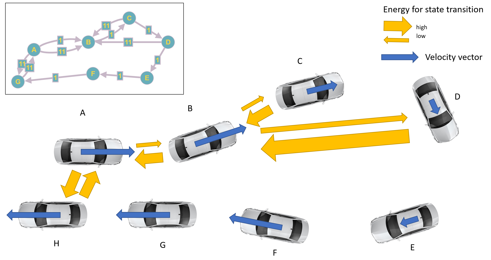



## Foreword

When it comes to safety of autonomous vehicles (AV), we as society often claim that such a system must be safer as an average human driver.
To validate this requirement, the industry pushes metrics such as accident-free travelled distance, expecting to cover the most critical situations an AV would face.

Unfortunately, the amount of driven distance required to statistically prove the safety of such a system is huge. 
Even if we reduce the number of (quite expensive) real world tests to a minimum with simulated drives, the process of validating a new software version is still extremely challenging.
The simulation process must cover a high number of random routes in a simulated world at different weather and traffic conditions.
Just imagine the effort of modelling a whole city with its traffic network, vegetation, and traffic participants (Grand Theft Auto anyone?).

Thus, the industry takes a more focussed approach with *scenario-based testing* where the task of driving is separated in smaller chunks such as entering the road, 
driving straight, changing lanes or turning right in an intersection. Having all the scenarios simulated in various conditions, 
the industry claims to be very close to a perfectly safe system. Of course, for the maximum of realism, 
you still have to model the environment around the scenario, but the effort is extremely reduced.

A valid criticism to the scenario-based approach is the question whether the scenario catalogue (i.e. set of scenarios) 
maintained the developers or regulators will cover all critical situations where an AV could fail. 
To address this concern those catalogues are extended with situations from accidents observed in the past. 
In a manual manner, the AV developers carefully describe the accident in a machine readable format digestible by the simulation tooling.

This blog post will cover an additional source of crucial scenarios from the NHTSA’s crash data collection program – the Crash Investigation Sampling System (CISS). We will explore a method to make the accidents usable in simulation.

The fundamental motivation for us is:

> An autonomous system behaving well on those critical events shall bring us closer to the safety goal.

Across the next sections we will quickly go over the information available in the above mentioned data source. From the scene diagrams we will extract the trajectories (position over time) of all actors involved which then can be used for simulation.

## Using NHTSA accidents to improve safety

The database consists of 11358 highway accidents involving human injuries. It may be helpful to undestand the 
process of "sampling" the data. The following paragraph is taken from the official website hosted by NHTSA:

> After a crash has been sampled, trained Crash Technicians obtain data from crash sites by documenting scene evidence such as *skid marks*, fluid spills, and struck objects. They locate the *vehicles* involved, document the crash damage, and identify interior components that were contacted by the occupants. On-site inspections are followed-up with confidential interviews of the crash victims and a review of medical records for injuries sustained in the crash. *[...]*
> 
>  Personal information such as names, addresses, license and registration numbers, and even specific crash locations are not included in public CISS files.

Each accident is visualized in a *scene diagram*. The diagram shows the traffic participants at multiple points in time throughout the scenario from bird's eye view.

In addition to the diagram, NHTSA provides additional information about injuries, vehicle models, datetime etc. on their Crash Viewer:

Given the scene diagram and surrounding meta data from the database, our task is to extract realistic trajectories usable in simulation.

## Methodology

In a nutshell the process of extracting trajectories has the following steps:

1.	Extract vehicle shapes and labels from scene diagram
2.	Associate shapes to actual vehicles (i.e. assign vehicle IDs to extracted shapes)
3.	For each vehicle, order the shape positions by time of occurrence to obtain waypoints
4.	For each vehicle and its waypoints, generate a physically feasible trajectory

In the consecutive paragraphs we will go over each step and spend some light on each of them.

### Step 1: Extracting vehicle shapes from the diagram

The scene diagram is provided in two formats: PDF and BLZ (FARO® Blitz). The latter can be opened in every text editor and parsed as an XML.
Usually, the vehicles are encoded as <type=’gosmodel’>, the annotations such as “Event 1” are encoded labels and the road markings are polycurves. 
The gosmodel and label elements can be represented as a rectangle (polygon) with a particular heading angle.
The parsing logic for that is implemented in kopytjuk/nhtsa-ciss-python: Python API to NHTSA Crash Investigation Sampling System (CISS) (github.com).

### Step 2: Associate shapes to actual vehicles

Since the labels and the vehicles can be represented as rectangle, we can easily assign known vehicle IDs with the corresponding shapes by geometrical intersection (implemented by shapely’s intersect() method). For shapes without a label (this issue exists in some diagrams), a human has to intervene and add the corresponding pairing.

### Step 3: Order waypoints by occurence

Next, having the vehicle locations in the diagram we will order them in time. The task is relatively straightforward for us humans,
since we see the direction of the road, we see where the collision happened and can easily imagine the temporal order of events.
However, this ordering shall be done in automated manner. Note that since the diagrams were created (drawn) manually, 
there is no sequence numbering included in the BLZ file.

If we see the ordering problem as a graph with vehicle positions as vertices and the kinematic energy needed to transition between position as edges, we can use travelling salesman algorithms to find the right order.

Note that the distance alone is not the only factor for the energy required. To drive from B to A you have to brake (spend energy) and drive reverse. 
Alternatively, you need to drive in circle. Driving from A to B however needs far less energy – the car solely faces air resistance and friction of the road (which is true for the former case, too). 
Another example is B->C vs. B->D, where a larger distance has to be driven (together with a 90° turn). 
For computing required energy we take a simple vacuum cleaner robot model which can only go straight or turn.

The travelling salesman optimal solution will find the most energy efficient (and thus most likely the actual) order of vehicle states.

Note that this approach can be extended with a more sophisticated model and/or cost function.
This may be needed in complex situations (e.g. states before and after collision).

### Step 4: Generate drivable trajectories

Next, we need to derive a set of trajectories for each actor. The trajectories have to be physically feasible and pass the waypoints ordered previously.

Since we look for a trajectory and not only the path, we need to add time to our waypoints. 
Due to the nature of the diagram, there is no time information available. 
We need to assign plausible timestamps considering the information from CISS database (e.g. speed limit or case description).
In the example outlined in this post, we take 2s as an equidistant time period between waypoints.

One way to do that is to employ a real vehicle model and solve an optimal trajectory problem given the waypoints and their timestamps as constrains. 
The cost function for that problem shall favour human acceleration and steering behaviour.
A more simple, faster but not necessarily realistic approach is to fit two (x & y) spline functions over time:

$$
TODO
$$

We can give the initial and final velocities (speed limit from the database and 0) as constraints to the fitting algorithm.
I used scipy.interpolate.make_interp_spline — SciPy v1.9.3 Manual for fitting the trajectories.

In the following animation the four involved vehicle trajectories are visualized:



In case the trajectories are not plausible (deceleration without obvious reasons, like V4 at 0:02) or physical feasible repeat the fitting process with different timestamps and initial velocities. The idea for this iterative process was taken from [1]. The physical feasibility can be checked on the curvature or acceleration/velocity signal of the trajectory. Imagine a heavy vehicle accelerating with 1G, which is only possible with tuned Cybertruck.

## Summary

This blog post outlines the methodology to make accident database data from NHTSA available for simulation of self-driving vehicles. Parsing the scene diagrams we can extract trajectories (positions over time) which can be used in most simulation frameworks as an input for the traffic. Simulating >11000 accident cases from the perspective of each participant may be valuable to decrease the gap to a fully safe system.

## References

