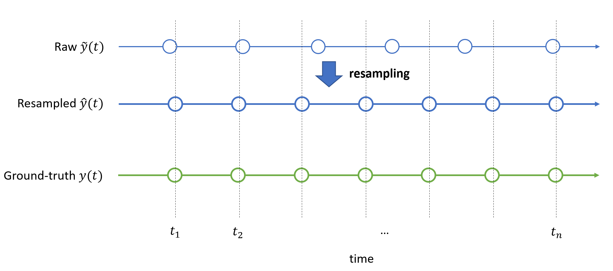
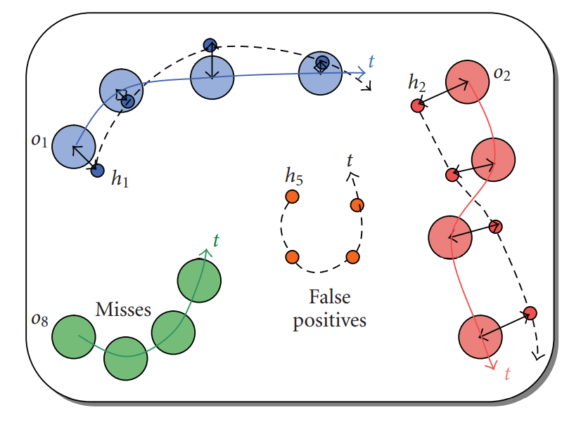
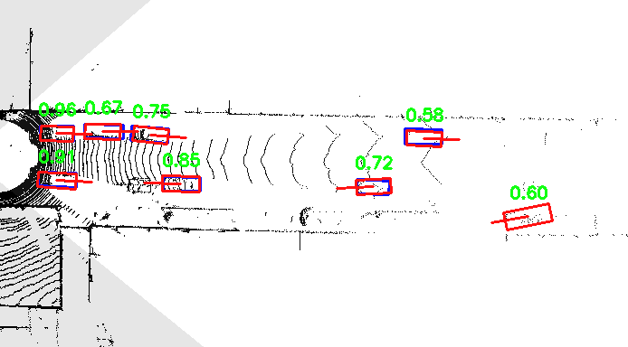
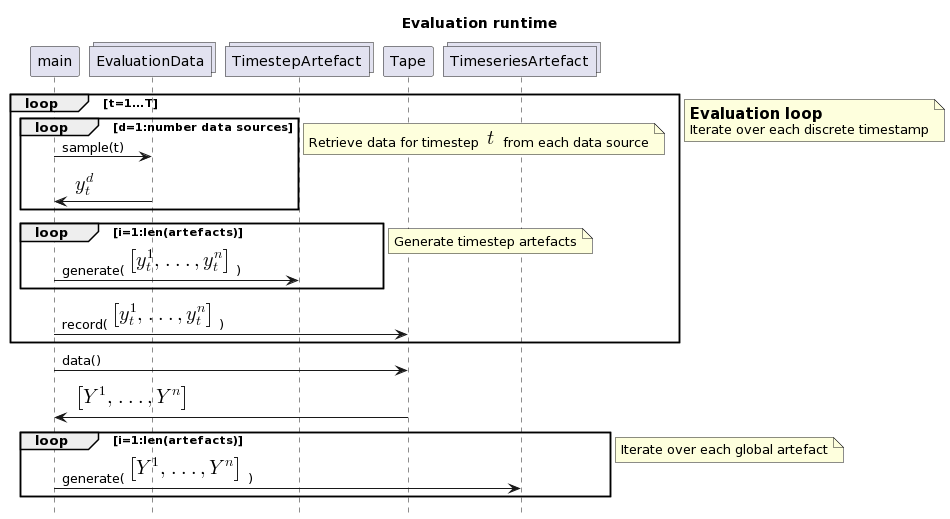
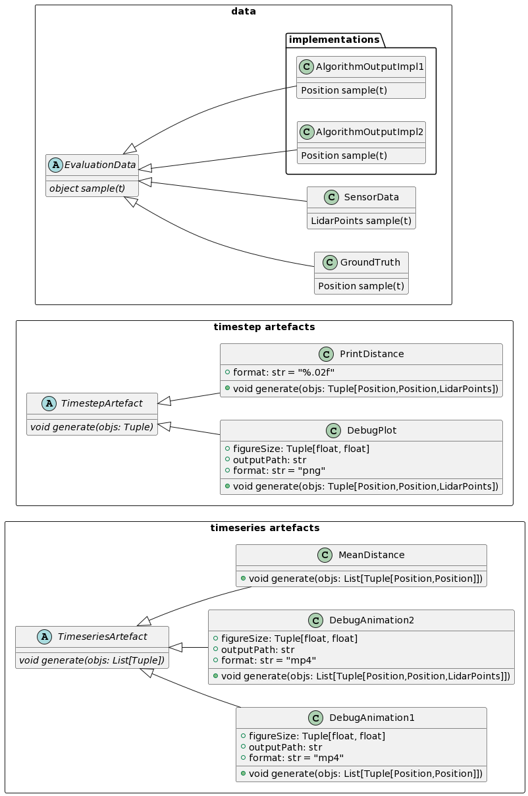

## Introduction

Evaluating complex systems operating is noisy real world environments is hard. Especially if you are dealing with dynamic behaviour over time, the requirements to the evaluation toolchain grow with every novel insight. In the beginning you want to compute just a single number describing algorithm's performance (like mean squared error - *MSE*), but over the project's lifetime your requirements to the evaluation framework grow: at some point you wish to generate static visualizations, create reports over a time range, dig deep at some specific situations or simply render both the algorithm's output and the corresponding *ground-truth* (GT) in a video file.

In this post I will outline a modular software archecture for the evaluation codebase, which is imho simple and straightforward to extend and maintain. It proved one's worth across multiple projects I was involved in. The focus of this architecture is the assessment of dynamical algorithms (or systems) applied in the real world (such as robots, trackers or sensors) which experience unexpected behavior from the environment. In most cases this behaviour has to be further analyzed with additional metrics and plots.

## Basics

For the sake of better unterstanding, I'll introduce an artificial setting which helps to internalize the proposed concepts. Let's select the logistics domain and focus on a mobile robot picking and delivering small boxes in a production site. This warehouse is also filled with employees, pallet trucks and other moving objects which are to be detected and to avoided.

First, I'll introduce a formal language discrete systems the architecture deals with. Later, a set of possible subtasks and assessment examples for the robot are presented to motivate the need for an extensible, application-independent evaluation tooling.

### Descrete systems

In this post the focus lies on the assessment of *discrete* systems, which output an action or detection at specific points in time (timesteps). Moreover it will be assumed, that *equidistant* outputs are available, i.e. outputs are generated in a fixed output rate. This assumption rarely holds in real-world scenarios, where the output rate depends on system's load, other processes and the state of the environment. Thus, for the assessment, it is often helpful to *resample* or *interpolate* the signal to equidistant timesteps. Those timesteps can be seen as the *clock* of the evaluation routine. 

Usually, for each timestep, there is a soft of ground-truth data, representing the desired behaviour of the system at particular point in time. For a mobile robot in logistics it can be a safe path, or for the object-detection task, the collection of ground-truth objects, which have to be tracked.

The system's output signal $\tilde{y}(t)$, the resampled version $\hat y(t)$ and the corresponding ground-truth $y(t)$ can be visualized in a timeline:

The clock for the evaluation is represented discrete timesteps $t_1, ..., t_n$. Note that there is no "rule them all" resampling method - it is engineers' task to select an interpolation method valid for the particular signal of interest.

### Assessment examples

#### Example 1: Localization

In the first example, the robot's output can be its perceived position which has to be compared with it's actual position:

$$
y_1(t) = \begin{bmatrix} x_1(t) \\
    x_2(t) \\
    \varphi(t)
\end{bmatrix} 
= \begin{bmatrix} \mathbf x(t) \\
    \varphi(t)
\end{bmatrix}
$$

This assessment can be accomplished with a *mean euclidean distance*  $e(t) = ||\mathbf{\hat x}(t) - \mathbf{x}(t)||_2$ over evaluation duration $T$:

$$
MED = \frac{1}{T}\sum_{t=1}^T e(t)
$$

If you are interested in other localization metrics in ADAS context, please refer to [[2]](https://doi.org/10.3390/s21175855), where more sophisticated metrics (considering bounding boxes) are introduced.

#### Example 2: Object tracking

The next valuable assessment can be whether the system is detecting all objects (e.g. humans, pallets) within its own perception area to avoid them while navigating. The robot internally holds a list of detected objects, i.e.:

$$
y_2(t) = \mathcal{O}_t = \lbrace o_1, o_2, \dots, o_n \rbrace_t
$$

Each object in the list is described by its unique ID, coordinates and heading, i.e. $o_i = [\text{id}, \mathbf x, \varphi]$.

For the object tracking subtask, metrics like *multiple object tracking precision* (MOTP) or the *multiple object tracking accuracy* (MOTA) from [1] can be employed. The idea will be shortly presented below:

Small circles represent the actual objects (ground-truth) the large ones are the objects detected by the system (also called *object hypotheses*). MOTP metric counts the number of misdetections, false detections, ID changes etc. over time. The MOTA metric computes the mean length of black arrows (i.e. the distances between detected and actual objects). For example a constant distance offset between the hypotheses and GT can be attributed to a sensor misalignment.

----

In addition to numeric metrics, for a deeper scene understanding you probably want to visualize the object bounding boxes (red: hypotheses, blue: ground-truth) and sensor data for a particular timestep, similar to the image below[3]:

### Summary

So far, a set of potental subtasks (path following and object detection) together with corresponding metrics was introduced. On the first glance they share little between each other - each one needs a specific treatment and its own implementation. In the next section I'll try define a generic language for the evaluation problem and propose an application-independent, extensible architecture.

## Architecture

First, we will summarize all possible plots, metrics, visualizations and derivates as *artifacts*. Further we will group them into two categories:

- *Timestep artifacts* can be generated from data available at a particular timestep $t$. For example, to compute the distance $e(t)$ between perceived position and it's actual position of the robot we only need the data from $t$. Another example is the previous image - you only need sensor data and the objects (both GT and hypotheses) from timestep $t$.
<!-- Artifacts which can be created  iteratively (one timestep after each other) would also fit in that category - an example is the sum of all distances over time $\sum_t e(t)$ or writing into a video buffer. -->
- *Timeseries artifacts* however, aggregate data multiple timesteps. For example, in order to compute the mean distance (MED) you need the distances $e(t)$ from all $t$s. Animations which involve multiple frames also involve data from multiple timesteps. For the sake of simplicity, I'll focus on artifacts which involve all timesteps, i.e. a data list of length $T$.

Further, let's generalize both the output data from the system/algorithm under test, sensor data and the ground-truth data as `EvaluationData`. Instances of this class have a `sample(t)` method to retrieve the data from a particular timestep $t$.

The evaluation loop iterates over all timesteps, retrieves data from available data sources and generates timeseries-artifacts. Additionally, for the timeseries artifacts, the data has to be collected over time - you can think of a recording tape. After all timesteps are processed, the timeseries artifacts are created.

As you can see, the methods `sample(t)`, `generate()` and `record()` are the core of the architecture.

----

The following class diagram shows the abstract classes `EvaluationData`, `TimestepArtifact` and `TimeseriesArtifact` and together with their implementations. You can inherit from the abstract classes whenever you need a new artifact or a data source.

You can extend your codebase with new metrics and plots and pass the list of desired artifacts to the evaluation loop without touching the loop's codebase itself. The majority of code changes happen in the implementations of the artifacts and data sources.

Moreover you can replace the algorithm under test by providing a different implementation as it was done with `AlgorithmOutputImpl1` and `AlgorithmOutputImpl2` - you can even have them both at the same time for comparison. The only thing to extend, is to create a new family of artifacts supporting multiple algorithm outputs in the signature of `generate`.

Also, bote that you have full access to the whole data after feeding the `Tape` instance via `record()` , which simply logs the data to memory or disk.

## Summary

Assessment and analysis of real world (discrete) systems can get more and more complex over time. The proposed architecture with a main loop over evaluation timesteps, a collection of data sources and two separate artifact groups allows easy replacement, straightforward extensibility and modularity by introducing clean interfaces to retreive and consume evaluation data.

You want to use this architecture template if the following is true:

- you have a discrete and dynamic system under test
- you have multiple algorithm implementations for the same task
- you have a large number of evaluation artifacts and the collection certainly will grow over time

Of course, the proposed structure is an overkill for small number of metrics for application in "noise-free" envirnoments, where an extension towards more insights won't be needed.

## Possible extensions

Nobody is perfect - this fact also applies to the architecture above. Here a list of further possible extensions:

- *Timeseries artifacts* for variable sized (<T) lists.
- Configuration management for data sources and artifact collections. Serializing data source and artifact instances allows to reproduce the same plots and metrics at a different point of time.
- Manage passing arguments to `generate`. Havin multiple data sources allows a combination of different data constellations. Currently the `generate` signature solely accepts a list of objects equal to the number of data sources.
- Parallelization - you can split the main loop over $t$ into small batches to decrease the runtime of a single run.

## References

[1] Bernardin, K., Stiefelhagen, R. *Evaluating Multiple Object Tracking Performance: The CLEAR MOT Metrics.* EURASIP Journal on Image and Video Processing (2008)

[2] Rehrl, K.; Gröchenig, S. *Evaluating Localization Accuracy of Automated Driving Systems.* Sensors 2021, 21, 5855.

[3] Yang, Bin & Luo, Wenjie & Urtasun, Raquel. (2019). *PIXOR: Real-time 3D Object Detection from Point Clouds.*

The UML plots were generated with [PlantUML](https://plantuml.com/en/), you can find the sources on [GitHub](https://github.com/kopytjuk/kopytjuk.github.io/tree/main/content/posts/kpi-architecture), in the root folder of this post.