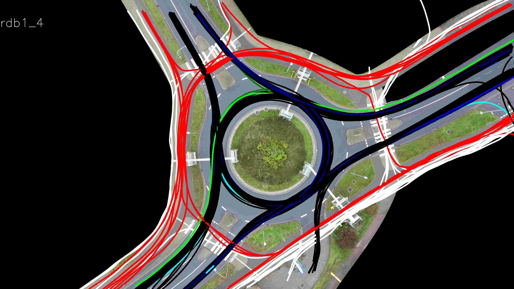
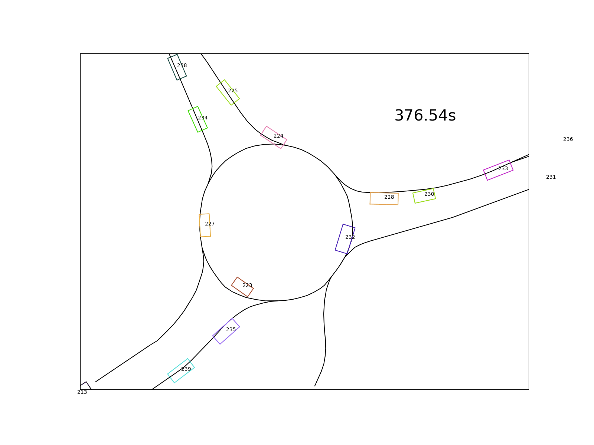
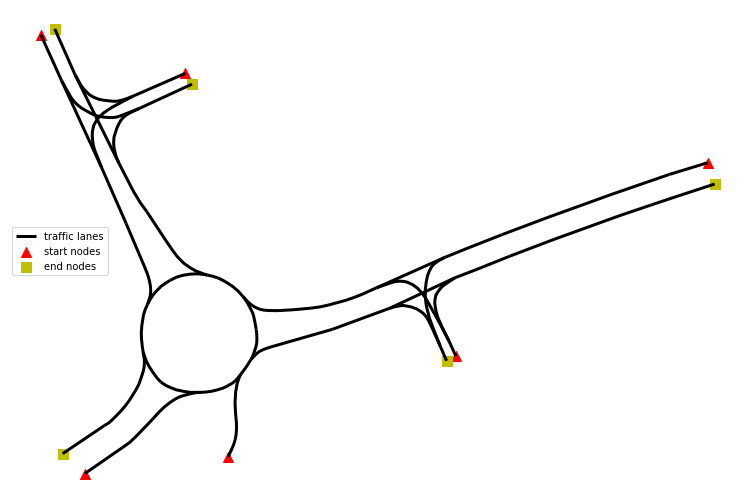

<script type="text/javascript"
src="https://cdnjs.cloudflare.com/ajax/libs/mathjax/2.7.1/MathJax.js?config=TeX-AMS-MML_HTMLorMML">
</script>

<script type="text/x-mathjax-config">
MathJax.Hub.Config({
  tex2jax: {
     inlineMath: [['$','$'], ['\\(','\\)']],
     displayMath: [['$$','$$']],
     processEscapes: true,
     processEnvironments: true,
     skipTags: ['script', 'noscript', 'style', 'textarea', 'pre'],
     TeX: { equationNumbers: { autoNumber: "AMS" },
            extensions: ["AMSmath.js", "AMSsymbols.js"] }
  }
});
</script>

## Contents <!-- omit in toc -->

- [Introduction](#introduction)
- [Dataset description](#dataset-description)
  - [Trajectories](#trajectories)
  - [Roundabouts](#roundabouts)
  - [Data schema](#data-schema)
- [Terminology](#terminology)
- [Approach](#approach)
  - [Overview](#overview)
  - [Trajectory pre-processing](#trajectory-pre-processing)
  - [Drivable paths](#drivable-paths)
  - [Assignment of vehicle trajectories to paths](#assignment-of-vehicle-trajectories-to-paths)

## Introduction

Recently, I stumbled upon the *OpenDD – A Large-Scale Roundabout Drone Dataset*[1] which contains about 80,000 different road users (also pedestrians) tracked over 62 hours of data across 7 roundabouts in Wolfsburg and Ingolstadt (Germany). The road users were tracked via a DJI Phantom 4, a high-end consumer drone floating over the roundabout.

The following visualization shows trajectories tracked in one of available recodings. The color describes the type of road user. Pedestrians are colored in red, vehicles in black, cyclists in green:



I decided to use this dataset as a playground to sharpen my skills regarding trajectory analysis helpful in my future job. After several weeks dealing with the data, I decided to share my approach and results, in case someone faces a similar task analyzing driving trajectories.

This article may be of interest to people who conduct spatiotemporal trajectory analysis in Python (e.g. automated pilot evaluation) or folks just interested in traffic analysis. I’ll try to describe the approaches I use in an intuitive way and link to the GitHub repository with helpful classes and helper functions.

The goal I set for the analysis is to quantify drivers’ behavior in roundabouts regarding the delays and distances in moving off situations. Below (in the bottom left corner) you see a situation where the cyan vehicle moves off with a delay after the leading purple vehicle already left.



The following questions arise on a large collection of such situations:

- Do drivers behind a standing vehicle wait until it moves off or do they move off simultaneously?
- What is the average distance between the leading and following vehicle while waiting?
- What is the average time delay between the leading and following vehicle after the first moved off?

## Dataset description

### Trajectories

The paper attached to the dataset already provides some basic statistics about the dataset (Table II in [1]). Some interesting facts:
- Out of 84774 trajectories the vast majority (69399) were passenger cars
- Average velocity of all road users is around 24km/h.
- Busses accelerate slower (0,97 m/s²) than cars (1,49 m/s²), vans (1,39 m/s²) and trucks (1,23m/s²).

### Roundabouts

The 7 roundabouts within the dataset have a single driving lane in the circular sections, so no overtakes can be assumed. An overview of the seven roundabouts included in the dataset is shown in the next image[1]:


In addition to the bird-view images, the geometrical description of the driving lane center is provided (in UTM32N coordinates). In the following image each lane segment of roundabout `rdb1` is visualized with a unique color:


Later in the analysis, the geometrical description will be crucial to describe paths.

### Data schema

The video footage taken by the drone in 30fps is stabilized and rectified before it is used to detect and track all traffic participants in the given scene. Unfortunately, there are no details about the tracking method used to extract objects’ position from raw video data.

The trajectories captured by the tracker are provided in tabular structure. In the following table a selection of columns relevant for the analysis is presented:

| **Column(s)** | **Description** | **Unit** |
|---------------|-----------------|----------|
|`TIMESTAMP`| Timestamp of the given object instance. Counted from the beginning of the given recording. |  s  |
|`OBJID`| ID of the object this instance belongs to. Unique over the dataset. | - |
|`UTM_X`,`UTM_Y` | UTM 32N coordinates of the center of the object instance. | m |
|`V` | Velocity of the object | m/s |
|`ACC` | Acceleration of the object. | m/s² |

This is how the top 10 rows look like:


Note, that the trajectories are not referenced to specific traffic lanes, i.e. the assignment to a particular road segment is up to the analyst.

## Terminology

Later in this article I often will use the terms *trajectory* and *path*. The destinction of these two is crucial.

Formally, a **trajectory** contains time-ordered set of states of a dynamical system. A trajectory can represent the position of the vehicle or its velocity over time. The time component is the main difference compared to a **path**. A trajectory can be represented as a path by dropping the time information.

## Approach

### Overview

In order to introduce the notion of a following and a leading vehicle, it’s required to assign each vehicle to a particular driving path. Position and timestamp alone are not sufficient to define this relationship. The assignment to a particular path relies on the *Hausdorff* distance metric.

After a vehicle trajectory is assigned to a particular path, it will be transformed into Frenet coordinate system, where the first coordinate represents the progress along the path and the second coordinate the distance to the center of the driving lane. As shown later, the Frenet coordinates provide a mathematically handy way to describe path-related metric distances and temporal delays between several road users.

Furthermore, a driving state is assigned to each sample in the trajectory. A vehicle can be either in the driving or standing state. This information will be used to determine the behavior of the following vehicle in moving-off situations of the leading vehicle.

The approach will be structured in multiple parts. In the first part, the pre-processing of the trajectories is described. In the second part, available paths from road network description are obtained. Having both the trajectories and drivable paths, the assignment is demonstrated. Having both the trajectory and corresponding path, the transformation to the Frenet coordinates is possible. Finally, in the last part, the behavior of the leading and following vehicles is quantified.

### Trajectory pre-processing

In the raw dataset the samples are loosely mixed in one single table. In order to generate trajectories, we must group by `OBJID` and sort by `TIMESTAMP`.

```python
def _generate_trace(group_records: pd.DataFrame) -> pd.Series:
    
    group_records = group_records.sort_values("TIMESTAMP")
    x_arr = group_records["UTM_X"]
    y_arr = group_records["UTM_Y"]
    ls = LineString([(x, y) for x, y in zip(x_arr, y_arr)])

    velocity = group_records["V"].values
    acceleration = group_records["ACC"].values

    first_sample = group_records.iloc[0]
    
    # helpful metadata
    objid = first_sample["OBJID"]
    obj_class = first_sample["CLASS"]
    w = first_sample["WIDTH"]
    l = first_sample["LENGTH"]
    t0 = first_sample["TIMESTAMP"]
    
    # whole trajectory in one record
    s = pd.Series({
        "OBJID": objid,
        "CLASS": obj_class,
        "WIDTH": w,
        "LENGTH": l,
        "START_TIME": t0,
        "NUM_SAMPLES": len(x_arr),
        "V": velocity,
        "ACC": acceleration,
        "geometry": ls
    })
    return s

# dataframe holding trajectories
df_traces = df.groupby(id_column).apply(_generate_trace)
```

Applied to the raw table, the trajectories DataFrame looks like following:


The paths of objects are stored in the `geometry` column as a `Linestring` instance. In addition, its velocity and acceleration are collected. They are used to determine the driving state, as shown in the snippet below.

```python
class VehicleState(IntEnum):
    STANDING = 0
    DRIVING = 1

# identify standing if velocity and acceleration are below the thresholds
states[:] = VehicleState.DRIVING.value
standing_indices = (np.abs(velocity_array) < standing_vel_threshold) & \
    (np.abs(acc_array) < standing_acc_threshold)
states[standing_indices] = VehicleState.STANDING.value
```

The drive-offs are now straightforward to detect by finding the point in time, where the state changes from `STANDING` to `DRIVING`.

In the following figure, the velocity, acceleration and state are visualized for two example trajectories. The second vehicle stops 1s after the first vehicle has stopped (174). After a standing period of 5s, both vehicles drive off almost immediately:


### Drivable paths

In this section the extraction of drivable paths from the road network is described. First, the road network will be represented as a *directed graph*. Second, the drivable paths are extracted with a graph-based path finding algorithm.

The initial road network is provided in multiple rows with corresponding road section as a linestring (as visualized in the dataset description):


In order to transform the data to a directed graph the `momemy` library is used. As stated in the docs, momepy stands for Morphological Measuring in Python.

```python
import momepy

traffic_lanes_graph = momepy.gdf_to_nx(trafficlanes, approach='primal',  
    directed=True, multigraph=False)
```

The `gdf_to_nx` function determines the graph structure solely by the course of the linestring and its starting and ending points.

Having the graph as `networkx.classes.digraph.DiGraph` the entering and leaving nodes of the road network are straightforward to retrieve:

```python
start_nodes = [node for node, degree in traffic_lanes_graph.in_degree if degree == 0]
end_nodes = [node for node, degree in traffic_lanes_graph.out_degree if degree == 0]
```

Both the start and end nodes are visualized in the following figure as triangles and squares respectively:



In order to find all possible paths, the shortest path between each pair of starting and ending node is computed:

```python
for i, (start, end) in enumerate(product(start_nodes, end_nodes)):
    
    # find path
    path = nx.shortest_path(traffic_lanes_graph, start, end)
    
    # convert to linestring
    path_as_ls = graph_path_to_linestring(traffic_lanes_graph, path)
    
    paths.append(DrivablePath(i, path_as_ls))
```

In the next visualization all drivable reference paths are displayed at once:


In the following section it'll be described how each vehicle trajectory is assigned to a reference path.

### Assignment of vehicle trajectories to paths

In a nutshell, in order to select the corresponding path to a trajectory, a similarity metric between the trajectory and all paths is computed. The assignment is based on the minimal distance – i.e. the path with highest similarity will be selected.

A similarity of two paths (drivable lane and vehicle’s path) can be defined in multiple ways. One solution can be to take the maximum distance between those two. A clear mathematical formulation for this problem is provided by the *directed Hausdorff distance* with the following formula [2]:

$$
h(P, Q) = \min_{p \in P} \max_{q \in Q} ||p-q||
$$

The P denotes the vehicle’s path and Q the reference path. Note that the distance metric is not symmetric, i.e. the order of P and Q is important. The distance is implemented in `scipy.spatial.distance.directed_hausdorff`. Note, that `shapely`’s implementation computes the undirected Hausdorff distance which is not suitable for this problem.
