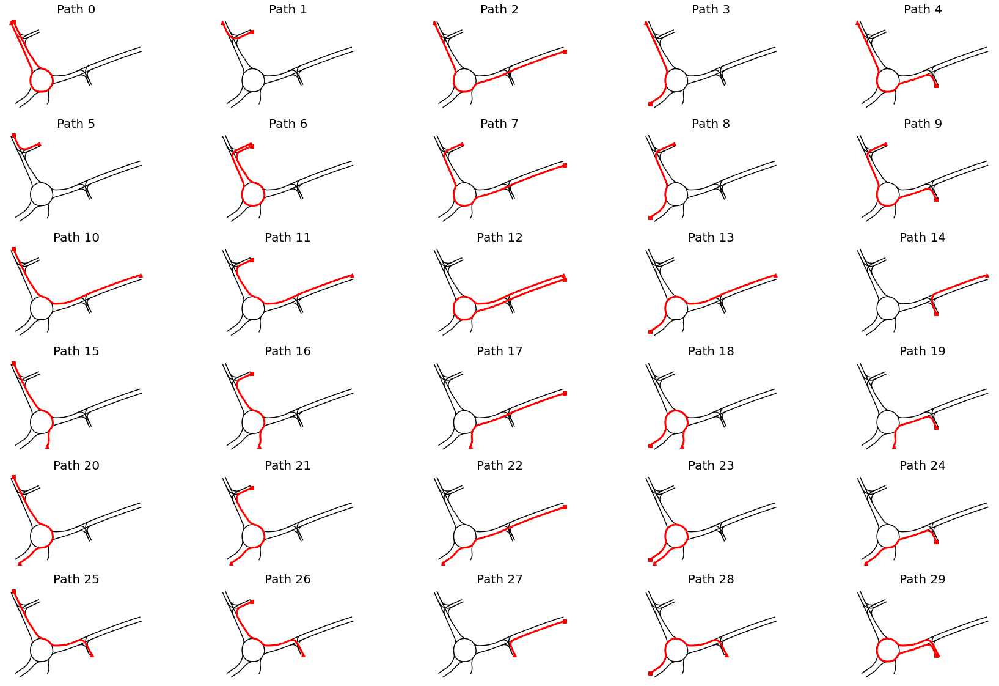

## TL;DR; <!-- omit in toc -->

This blog post presents the benefits of Frenet-Serret coordinate system for driving trajectory analysis (in Python). This system is defined by a reference path, such as a driving lane and facilitates traffic analysis. As an showcase example, the delay times and distances between vehicles in a roundabout setting are analyzed. The trajectories captured from a bird-view perspective (DJI drone) from the OpenDD dataset are used. In the end of the post, the reader will value the advantages of Frenet-Serret frames compared to a conventional metric approach when it comes to trajectory analysis in a real-world setting. Moreover, you will have a handy mathematical tool to detect tipsy drivers!

## Contents <!-- omit in toc -->

- [Introduction](#introduction)
- [Dataset description](#dataset-description)
  - [Trajectories](#trajectories)
  - [Roundabouts](#roundabouts)
  - [Data schema](#data-schema)
- [Terminology](#terminology)
- [Approach](#approach)
  - [Overview](#overview)
  - [Trajectory pre-processing](#trajectory-pre-processing)
  - [Drivable paths](#drivable-paths)
  - [Assignment of vehicle trajectories to paths](#assignment-of-vehicle-trajectories-to-paths)
  - [Transformation to Frenet–Serret coordinates](#transformation-to-frenetserret-coordinates)
  - [Behaviour analysis](#behaviour-analysis)
- [Results](#results)
  - [Behaviour of the following vehicles](#behaviour-of-the-following-vehicles)
  - [Delay](#delay)
  - [Distance](#distance)
- [Summary & outlook](#summary--outlook)
- [References](#references)

## Introduction

Recently, I stumbled upon the *OpenDD – A Large-Scale Roundabout Drone Dataset*[1] which contains about 80,000 different road users (also pedestrians) tracked over 62 hours of data across 7 roundabouts in Wolfsburg and Ingolstadt (Germany). The road users were tracked via a DJI Phantom 4, a high-end consumer drone floating over the roundabout.

The following visualization shows trajectories tracked in one of available recodings. The color describes the type of road user. Pedestrians are colored in red, vehicles in black, cyclists in green:


I decided to use this dataset as a playground to sharpen my skills regarding trajectory analysis helpful in my future job. After several weeks dealing with the data, I decided to share my approach and results, in case someone faces a similar task analyzing driving trajectories.

This article may be of interest to people who conduct spatiotemporal trajectory analysis in Python (e.g. automated pilot evaluation) or folks just interested in traffic analysis. I’ll try to describe the approaches I use in an intuitive way and link to the GitHub repository with helpful classes and helper functions.

The goal I set for the analysis is to quantify drivers’ behavior in roundabouts regarding the delays and distances in moving off situations. Below (in the bottom left corner) you see a situation where the cyan vehicle moves off with a delay after the leading purple vehicle already left.


The following questions arise on a large collection of such situations:

- Do drivers behind a standing vehicle wait until it moves off or do they move off simultaneously?
- What is the average distance between the leading and following vehicle while waiting?
- What is the average time delay between the leading and following vehicle after the first moved off?

## Dataset description

### Trajectories

The paper attached to the dataset already provides some basic statistics about the dataset (Table II in [1]). Some interesting facts:
- Out of 84774 trajectories the vast majority (69399) were passenger cars
- Average velocity of all road users is around 24km/h.
- Busses accelerate slower (0,97 m/s²) than cars (1,49 m/s²), vans (1,39 m/s²) and trucks (1,23m/s²).

### Roundabouts

The 7 roundabouts within the dataset have a single driving lane in the circular sections, so no overtakes can be assumed. An overview of the seven roundabouts included in the dataset is shown in the next image[1]:


In addition to the bird-view images, the geometrical description of the driving lane center is provided (in UTM32N coordinates). In the following image each lane segment of roundabout `rdb1` is visualized with a unique color:


Later in the analysis, the geometrical description will be crucial to describe paths.

### Data schema

The video footage taken by the drone in 30fps is stabilized and rectified before it is used to detect and track all traffic participants in the given scene. Unfortunately, there are no details about the tracking method used to extract objects’ position from raw video data.

The trajectories captured by the tracker are provided in tabular structure. In the following table a selection of columns relevant for the analysis is presented:

| **Column(s)** | **Description** | **Unit** |
|---------------|-----------------|----------|
|`TIMESTAMP`| Timestamp of the given object instance. Counted from the beginning of the given recording. |  s  |
|`OBJID`| ID of the object this instance belongs to. Unique over the dataset. | - |
|`UTM_X`,`UTM_Y` | UTM 32N coordinates of the center of the object instance. | m |
|`V` | Velocity of the object | m/s |
|`ACC` | Acceleration of the object. | m/s² |

This is how the top 10 rows look like:


Note, that the trajectories are not referenced to specific traffic lanes, i.e. the assignment to a particular road segment is up to the analyst.

## Terminology

Later in this article I often will use the terms *trajectory* and *path*. The destinction of these two is crucial.

Formally, a **trajectory** contains time-ordered set of states of a dynamical system. A trajectory can represent the position of the vehicle or its velocity over time. The time component is the main difference compared to a **path**. A trajectory can be represented as a path by dropping the time information.

## Approach

### Overview

In order to introduce the notion of a following and a leading vehicle, it’s required to assign each vehicle to a particular driving path. Position and timestamp alone are not sufficient to define this relationship. The assignment to a particular path relies on the *Hausdorff* distance metric.

After a vehicle trajectory is assigned to a particular path, it will be transformed into Frenet coordinate system, where the first coordinate represents the progress along the path and the second coordinate the distance to the center of the driving lane. As shown later, the Frenet coordinates provide a mathematically handy way to describe path-related metric distances and temporal delays between several road users.

Furthermore, a driving state is assigned to each sample in the trajectory. A vehicle can be either in the driving or standing state. This information will be used to determine the behavior of the following vehicle in moving-off situations of the leading vehicle.

The approach will be structured in multiple parts. In the first part, the pre-processing of the trajectories is described. In the second part, available paths from road network description are obtained. Having both the trajectories and drivable paths, the assignment is demonstrated. Having both the trajectory and corresponding path, the transformation to the Frenet coordinates is possible. Finally, in the last part, the behavior of the leading and following vehicles is quantified.

### Trajectory pre-processing

In the raw dataset the samples are loosely mixed in one single table. In order to generate trajectories, we must group by `OBJID` and sort by `TIMESTAMP`.

```python
def _generate_trace(group_records: pd.DataFrame) -> pd.Series:
    
    group_records = group_records.sort_values("TIMESTAMP")
    x_arr = group_records["UTM_X"]
    y_arr = group_records["UTM_Y"]
    ls = LineString([(x, y) for x, y in zip(x_arr, y_arr)])

    velocity = group_records["V"].values
    acceleration = group_records["ACC"].values

    first_sample = group_records.iloc[0]
    
    # helpful metadata
    objid = first_sample["OBJID"]
    obj_class = first_sample["CLASS"]
    w = first_sample["WIDTH"]
    l = first_sample["LENGTH"]
    t0 = first_sample["TIMESTAMP"]
    
    # whole trajectory in one record
    s = pd.Series({
        "OBJID": objid,
        "CLASS": obj_class,
        "WIDTH": w,
        "LENGTH": l,
        "START_TIME": t0,
        "NUM_SAMPLES": len(x_arr),
        "V": velocity,
        "ACC": acceleration,
        "geometry": ls
    })
    return s

# dataframe holding trajectories
df_traces = df.groupby(id_column).apply(_generate_trace)
```

Applied to the raw table, the trajectories DataFrame looks like following:


The paths of objects are stored in the `geometry` column as a `Linestring` instance. In addition, its velocity and acceleration are collected. They are used to determine the driving state, as shown in the snippet below.

```python
class VehicleState(IntEnum):
    STANDING = 0
    DRIVING = 1

# identify standing if velocity and acceleration are below the thresholds
states[:] = VehicleState.DRIVING.value
standing_indices = (np.abs(velocity_array) < standing_vel_threshold) & \
    (np.abs(acc_array) < standing_acc_threshold)
states[standing_indices] = VehicleState.STANDING.value
```

The drive-offs are now straightforward to detect by finding the point in time, where the state changes from `STANDING` to `DRIVING`.

In the following figure, the velocity, acceleration and state are visualized for two example trajectories. The second vehicle stops 1s after the first vehicle has stopped (174). After a standing period of 5s, both vehicles drive off almost immediately:


### Drivable paths

In this section the extraction of drivable paths from the road network is described. First, the road network will be represented as a *directed graph*. Second, the drivable paths are extracted with a graph-based path finding algorithm.

The initial road network is provided in multiple rows with corresponding road section as a linestring (as visualized in the dataset description):


In order to transform the data to a directed graph the `momemy` library is used. As stated in the docs, momepy stands for Morphological Measuring in Python.

```python
import momepy

traffic_lanes_graph = momepy.gdf_to_nx(trafficlanes, approach='primal',  
    directed=True, multigraph=False)
```

The `gdf_to_nx` function determines the graph structure solely by the course of the linestring and its starting and ending points.

Having the graph as `networkx.classes.digraph.DiGraph` the entering and leaving nodes of the road network are straightforward to retrieve:

```python
start_nodes = [node for node, degree in traffic_lanes_graph.in_degree if degree == 0]
end_nodes = [node for node, degree in traffic_lanes_graph.out_degree if degree == 0]
```

Both the start and end nodes are visualized in the following figure as triangles and squares respectively:


In order to find all possible paths, the shortest path between each pair of starting and ending node is computed:

```python
for i, (start, end) in enumerate(product(start_nodes, end_nodes)):
    
    # find path
    path = nx.shortest_path(traffic_lanes_graph, start, end)
    
    # convert to linestring
    path_as_ls = graph_path_to_linestring(traffic_lanes_graph, path)
    
    paths.append(DrivablePath(i, path_as_ls))
```

In the next visualization all drivable reference paths are displayed at once:



In the following section it'll be described how each vehicle trajectory is assigned to a reference path.

### Assignment of vehicle trajectories to paths

In a nutshell, in order to select the corresponding path to a trajectory, a similarity metric between the trajectory and all paths is computed. The assignment is based on the minimal distance – i.e. the path with highest similarity will be selected.

A similarity of two paths (drivable lane and vehicle’s path) can be defined in multiple ways. One solution can be to take the maximum distance between those two. A clear mathematical formulation for this problem is provided by the *directed Hausdorff distance* with the following formula [2]:

$$
h(P, Q) = \min_{p \in P} \max_{q \in Q} ||p-q||
$$

The $P$ denotes the vehicle’s path and $Q$ the reference path. Note that the distance metric is not symmetric, i.e. the order of $P$ and $Q$ is important. The distance is implemented in `scipy.spatial.distance.directed_hausdorff`. Note, that `shapely`’s [implementation](https://shapely.readthedocs.io/en/stable/manual.html#object.hausdorff_distance) computes the undirected Hausdorff distance which is not suitable for this problem.

The next figure shows the $h(P, Q)$ computed against each of 30 reference paths for a single vehicle trajectory:


The path 3 is taken as reference path for the trajectory of interest. Note that reference path 8 is an equivalent candidate, too. Crosschecking the results, the the assigned reference path matches the driven path:


### Transformation to Frenet–Serret coordinates

First, a short description about the Frenet–Serret coordinate system in context of driving trajectories is provided. This coordinate system is also called *TNB frame*, refer to [Wikipedia](https://en.wikipedia.org/wiki/Frenet%E2%80%93Serret_formulas) for more details.


Like the cartesian coordinate system, the Frenet-Serret system also has two components. Contrary to the cartesian system however, both components both rely on the shape of the reference path. In other words, **the TNB frame relies on a reference path**.  The first coordinate $s$ describes the driven distance (also called *arc length*) along the reference path and $d$, the perpendicular distance to the point on the reference path corresponding to that arc length. Formally, the $s$ and $d$ components depend on the tangent and the normal along the reference curve (this is the explanation for the first two letters of *TNB* term). Commonly the reference path is defined on the center of a driving lane or road.

The next visualization shows an example with two vehicles, why this representation has its charm:


No matter how curvy the shape of the road is, you always can compute the driven distance between those two:

$$
d = s_2 - s_1
$$

Or you can detect, which side of the road they are driving on, looking at $d_1$ or $d_2$.

Often, while implementing the reference path in the code we do not have a nicely analytical expression, where it is easy to compute the tangent and the normal. In this analysis the reference path is implemented as a list of cartesian points (i.e. sampled path):

```python
@dataclass
class DiscreteReferencePath:
    """2D Path represented as an ordered list of points.
    """
    
    points: np.ndarray  # in path length s and cartesian (metric) coordinates, as Nx3 (s, x, y)
    spatial_resolution: float  # approximate
    
    def to_frenet(self, pt: Tuple[float, float]) -> Tuple[float, float]:
        """Transform a cartesian coordinate to a Frenet coordinate.

        Args:
            pt (Tuple[float, float]): cartesian coordinate (x, y)

        Returns:
            Tuple[float, float]: frenet coordinate (s, d)
        """
        
        pt = np.array(pt)
        
        # compute distances to each sample of the ref.-path
        deltas = np.linalg.norm(self.points[:, 1:] - pt, axis=1)
        
        # take the index of the minium
        idx_min = np.argmin(deltas)
        
        # arc length
        s = self.points[idx_min, 0]
        # perpendicular distance
        d = deltas[idx_min]
        return s,  d
```

The points `np.ndarray` holds the (cartesian) locations of points along the arc length $s$. In order to transform any cartesian coordinate $c$ to the Frenet system, the closest point on the reference path with an arc length $s^{c}$, $r(s^{c})$ is taken. The corresponding arc length $s^c$ and Euclidean distance between $c$ and $r(s^c)$ both are the resulting Frenet coordinates. This is implemented in the `to_frenet()` method.

Note, that the spatial resolution of the arc length affects the accuracy, i.e. a sparsely sampled reference curve will lead to atypical trajectories in Frenet space.

After transforming all available vehicle trajectories to Frenet space, it is possible to plot the vehicles' driven distances (arc length $s$) over time:


The higher the slope the faster the vehicle, horizontal time periods indicate that a vehicle does not move. In this visualization it is easy to find the distances between the vehicles at a particular point in time. For example, at $t=210s$ a distance of $\approx 10m$ for both vehicles (IDs `124` and `126`) can be observed.

### Behaviour analysis

Assuming no overtakes are possible, which is valid in a single-lane roundabout, let's iterate over each pair of trajectories and record both the distances and states of the follower vehicle at particular points in time, where the leading vehicle moves off. This logic is implemeted in `analyze_driveoffs_from_path()` routine in [3].

We encapsulate found events as a datastructure:

```python
@dataclass
class DriveOffSituation:
    """Analysis artifact representing a moving-off situation
    """
    
    # vehicle IDs
    o1_id: int  # leading
    o2_id: int  # following
    
    t: float  # time of the event
    
    distance: float  # distance between the objects
    
    # O2 properties
    o2_state: VehicleState
    o2_timedelta_drive_off: Optional[float] 
    o2_velocity: float
```

As a result, a table containing all moving-off situations is created with corresponding vehicle IDs, distances, delays, and states (here first 5 rows are show):


This table will be used for generating plots and computing statistics in the results section.

## Results
### Behaviour of the following vehicles

First, the focus will be on how many people move pre-emptively (even if the vehicle in the front is still standing). In general, it can be stated, that more than the half of people are already rolling, when the first vehicle is moving off.


This effect can be similar to daily observation behind a traffic light – the first vehicle is still standing behind the stopping line, whereas the following vehicles already rolling expecting the crowd to accelerate.

### Delay

The second aspect focuses on the time the second vehicle needs to move off after the first left. From the distribution it can be derived, that the majority needs a little more than a second. This number confirms the results from [3], where the reaction time for expected stimulus while driving is around $1s$ as well.


### Distance

Lastly, the distance between the vehicles while waiting shall be analyzed. An average distance slightly below 2 meters can be observed:


## Summary & outlook

This blog post demonstrates the advantage of Frenet coordinates for traffic trajectory analysis. This representation maps the locations relative to the reference path (e.g. driving lane) instead of a location in 2D plane.

So far in this post, only a “simple” situation type is covered – the delay and distance analysis between two vehicles. In a nutshell, the analysis confirms the general assumption regarding the delay time of approx. $1s$. In addition, a statistic about the average distance between two waiting vehicles shows a value of $2m$. Against my personal expectations, the majority of drivers already move off slowly even before the front vehicle starts moving.

The Frenet-Serret frame allows far more complex analyses such as overtaking manoeuver quantification, alcohol detection (by detecting fluctuations in the $d$-component of the Frenet representation), illegal line changes (considering the lane-types) or jerk analysis regarding the driving comfort. All those use-cases require a less complex logic within the Frenet framework  than a conventional Euclidean representation.

## References

[1] A. Breuer, J.-A. Termöhlen, S. Homoceanu and T. Fingscheidt, *OpenDD: A Large-Scale Roundabout Drone Dataset*, Proceedings of International Conference on Intelligent Transportation Systems, 2020.

[2] A. A. Taha and A. Hanbury, *An Efficient Algorithm for Calculating the Exact Hausdorff Distance*, IEEE Transactions on Pattern Analysis and Machine Intelligence, November 2015.

[3] Paweł Droździel, *Drivers ’reaction time research in the conditions in the real traffic*, Open Engineering, 2020. 

[4] https://github.com/kopytjuk/opendd-analysis