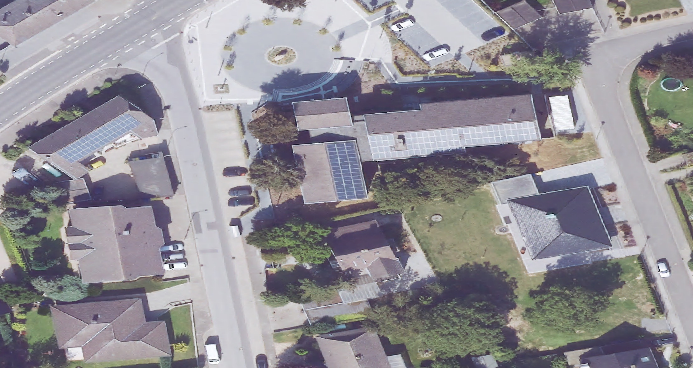
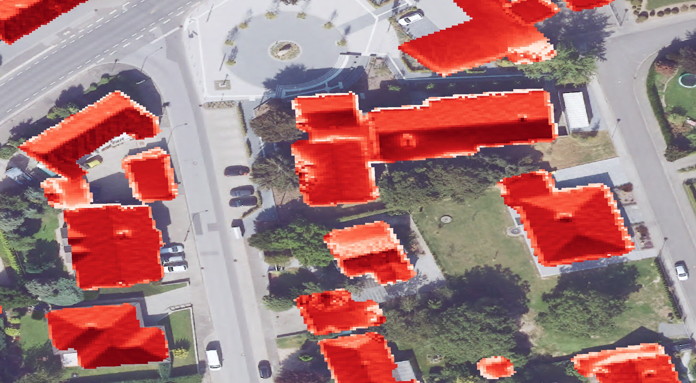
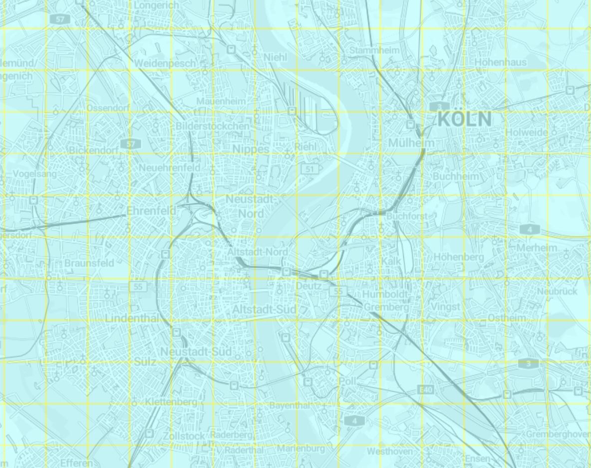
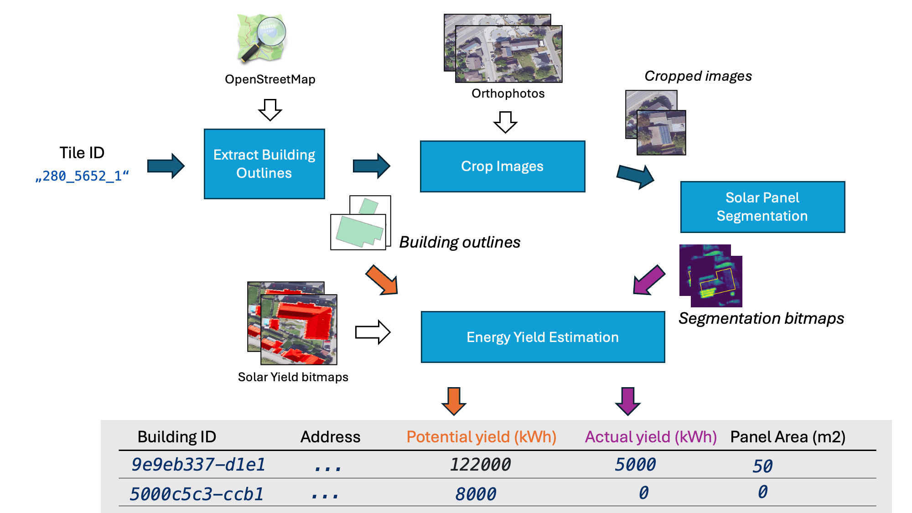
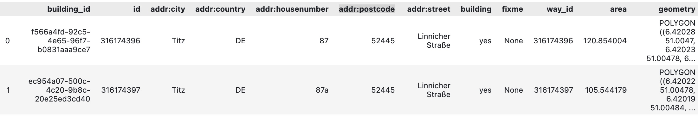
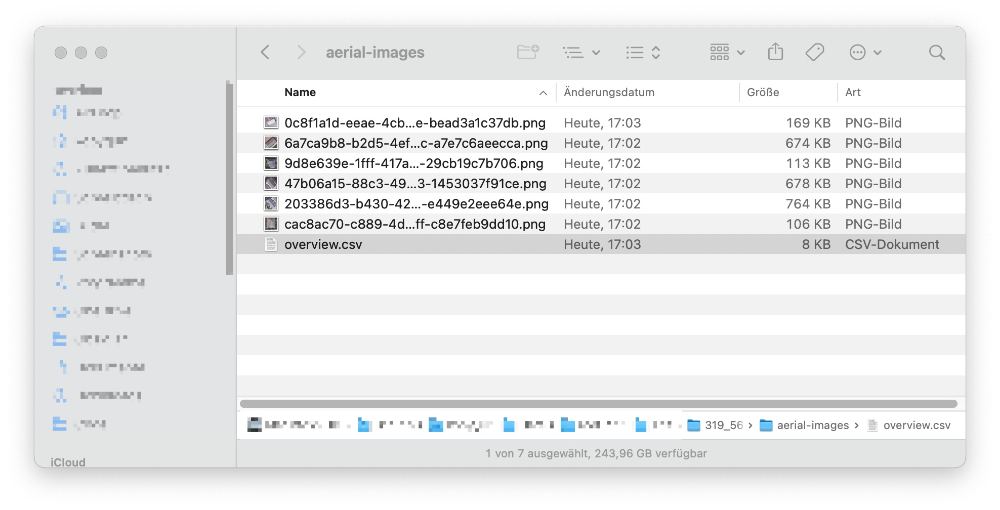
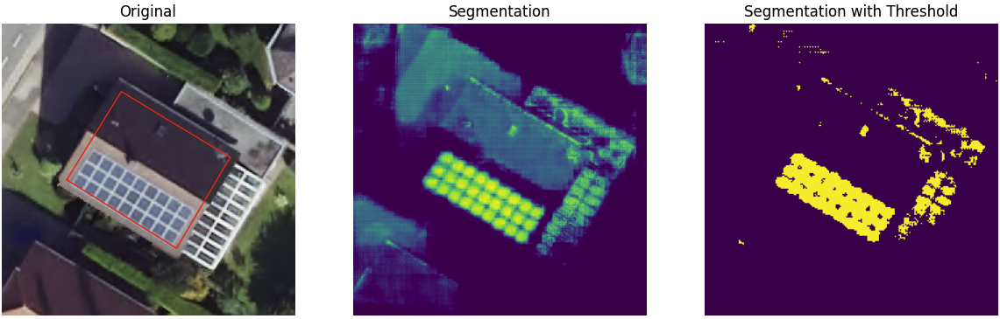
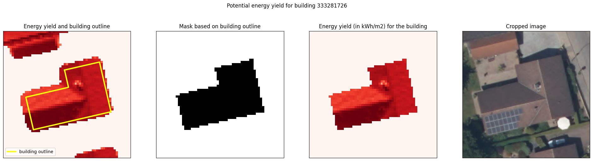
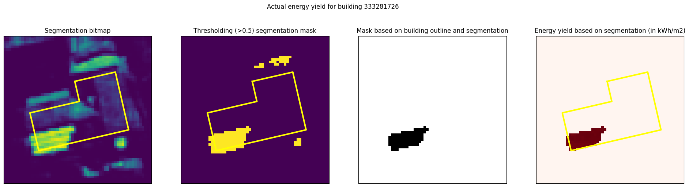
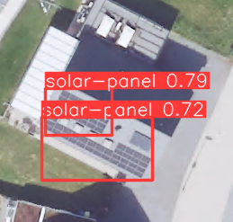

## Introduction

Have you ever wondered how many households in your neighborhood have a solar panel on their roof and 
how much solar energy is being harnessed?

By combining the power of aerial imagery, solar radiation maps and machine learning we can address those
questions. In this post I will explore an approach of detecting solar panels and estimating their annual energy yield.
I try to explain my idea step by step with many images and example calculations as possible. 

In the next blog post (Part II) we will run the method on a larger area (e.g. city or village) and discuss the results.

As a tiny appetizer, in the figure below you see an arial photograph of Titz, North Rhine-Westphalia with 
a almost-transparent overlay highlighting whether a solar panel is installed (green) or missing (purple):


## Table of contents

- [Introduction](#introduction)
- [Table of contents](#table-of-contents)
- [Datasets](#datasets)
  - [Aerial images](#aerial-images)
  - [Radiant exposure maps](#radiant-exposure-maps)
  - [Data organization](#data-organization)
- [Methodology](#methodology)
  - [Extracting building outlines](#extracting-building-outlines)
  - [Cropping aerial images](#cropping-aerial-images)
  - [Detecting solar panels](#detecting-solar-panels)
  - [Estimating energy yield](#estimating-energy-yield)
    - [Building mask](#building-mask)
    - [Solar panel mask](#solar-panel-mask)
    - [Considering solar panel efficiency](#considering-solar-panel-efficiency)
    - [Computing solar panel area](#computing-solar-panel-area)
- [Summary and outlook](#summary-and-outlook)
- [Code](#code)
- [Related projects](#related-projects)
- [References](#references)
- [Appendix](#appendix)
  - [Detection vs. Segmentation](#detection-vs-segmentation)


## Datasets

The main source for the described approach is based on the publicly available 
datasets from the [OpenGeodata.NRW](https://www.opengeodata.nrw.de/produkte/) portal. 
The OpenGeoData NRW portal is maintained by the state government of North Rhine-Westphalia (NRW) in Germany.

The portal offers a wide range of geospatial data, including high-resolution aerial images,
LIDAR measurements, land-property and solar yield maps.
Based on LIDAR data, also derived datasets such as digital surface and terrain models are provided.

We will focus on two particular data types, namely **orthophotographs** and **radiant exposure** maps, 
which we briefly explore in subsequent sections.

### Aerial images

Aerial photography (or airborne imagery) is the taking of photographs from an aircraft or other airborne platforms such as drones.
An aerial image is usually converted to an [**orthophotograph**](https://en.wikipedia.org/wiki/Orthophoto) in a process called
**orthorectification**. Unlike an uncorrected aerial photograph, an orthophoto can be used to measure true distances. In other words,
when we measure the distance between two trees, we can multiple the length value in pixels 
with a known scaling factor to obtain the true distance in meters.

For simplicity, I will use the term *aerial image* to refer to both aerial photographs and orthophotographs in this article.
The image below shows an example of a residential area:



For further analysis (e.g. to find a building to a particular location) the images have to be geo-referenced.
[Georeferencing](https://en.wikipedia.org/wiki/Georeferencing) is the process of 
assigning real-world coordinates to digital maps or images, 
allowing them to be accurately positioned and overlaid within a geographic information system (GIS).

Luckily, the coordinate information is already embedded in every image file allowing us to locate a particular spatial coordinate (e.g. a GPS longitude and latitude) to a single pixel.
The image data and georeferencing metadata are stored in [JPEG2000](https://en.wikipedia.org/wiki/JPEG_2000) format (`.jp2`). 
You can download and take a look at the images [here](https://www.opengeodata.nrw.de/produkte/geobasis/lusat/akt/dop/dop_jp2_f10/).

### Radiant exposure maps

In order to obtain the amount of solar energy a roof receives, we will
use the **radiant exposure** bitmaps (in German: *Solarkataster*). 
Radiant exposure is the radiant energy received by a surface per unit area ($\mathrm{J/m^2}$ in SI units) during a defined timeperiod $\Delta t$.

The image below shows an aerial image overlayed with radiant exposure map. Dark red areas indicate high energy yields whereas white color
indicates poor yield areas.



Each $0.5\mathrm{m} \times 0.5\mathrm{m}$ pixel of this bitmap contains the estimated annual ($\Delta t = 365*24\textrm{h}$) radiant exposure in $\frac{\mathrm{kWh}}{\mathrm{m^2}}$.

A small numeric example: if a pixel with a exposure value of $1125 \frac{\mathrm{kWh}}{\mathrm{m^2}}$ would overlap with a solar panel 
with 21% efficiency of the same size as the pixel ($ 0.5 \cdot 0.5 \mathrm{m^2} = 0.25 \mathrm{m^2}$),
that part of the solar panel would yield $1125 \cdot 0.25 \cdot 21\\% \approx 59 \mathrm{kWh}$  energy 
which is enough to boil (20°C) 491 litres of water annualy - should be enough for the daily dose of coffee.
Alternatively we could charge the Tesla Model S 100kWh battery to 59%.

This amount of electricity costs ca. 23€ in Germany, 7€ in Hungary or 9€ in USA for a private household (as of March 2025).

The radiant exposure was estimated using solar radiation and weather (cloud) data by the German Weather Service combined with
[digital surface models](https://en.wikipedia.org/wiki/Digital_elevation_model). The latter alter the available solar radiation with respect to roof angles
and obstacles (like trees or buildings) which reduce the annual solar yield further by casting shadows.
More specific details on how those maps are created can be found in [1].

The bitmaps are available in 50cm and 1m resolution (true length of each pixel) as GeoTIFF files `.tif`.
You can download the data [here](https://www.opengeodata.nrw.de/produkte/umwelt_klima/energie/solarkataster/strahlungsenergie_50cm/).

### Data organization

Before diving directly into technical details it is worth to spend a little time on understanding how the data
(both aerial images and exposure maps) are organized and stored.

The area of state North Rhine-Westphalia is around  $34000\mathrm{km}^2$. Since storing all the data in a single file is not
really realistic (think of a single aerial image with 10cm resolution per pixel), both the images and exposure maps
are stored in **tiles**. A tile covers a square with 1km (for aerial images) or 4km (for exposure maps) side length.

The following image shows the 1km-tile coverage of aerial images of the city of Cologne:



The tile information is encoded in the file name, here a breakdown of a single 
aerial image `dop10rgbi_32_280_5652_1_nw_2023.jp2`:

- `dop`: digital orthophotograph (i.e. aerial image)
- `10`: 10cm resolution
- `rgbi`: RGB with an infrared channel
- `32`: UTM32 (EPSG 25832) projection
- `280`: x-coordinate south west corner of the tile in km, here 280000m
- `5652`: y-coordinate south west corner of the tile in km, here 5652000m
- `1`: side length of the tile, here 1km
- `nw`: tile orientation, here north-west
- `2023`: recording year

## Methodology

The following workflow outlines the processing of a single 1km tile (here `"280_5652_1"`) with all the data sources and intermediate artifacts involved.

White arrows symbolize the usage of available data (e.g. aerial images) whereas the arrows with color indicate the flow of artifacts within the processing chain.
I.e. those artifacts change when another tile (spatial area) is processed, whereas the set of source aerial images stays the same.



Enough said, let's dive into the processing steps. We start with the first blue box, where given a tile extent all buildings, described by their address, 
exact location and polygon outlines (e.g. rectangles for simple 4-wall buildings) are extracted from OpenStreetMap (OSM).

Each building is identified with a unique ID (we will just reuse the original `way_id` from OSM). The outline is used for cropping images and for extracting the solar yield.

A square-shaped area around a single building is cropped from the large aerial image tiles. 
The images are passed to an Machine Learning (ML) based solar-panel detection model which assigns to each pixel a solar-panel existence probability.

The building outlines (i.e. the building roofs) combined with solar energy yield bitmaps provide the **potential** (i.e. maximimal possible) amount of energy.
The segmentation results are combined with solar energy yield data as well.
Together with some assumptions about the solar panel efficiency we use both to estimate the **actual** energy yield, as harnessed anually. 

The information flows into a final tabular dataset (table in grey) which can be further employed to answer
our introductory questions about installation rates of solar panels.

In the subsequent sections we will dive deeper into the technical nuances of each step.
Feel free to skip to **Part 2** of this post (**WIP**) to see what we can do with the outputs of this process.

### Extracting building outlines

First, we need to extract all buildings which exist in the desired tile (i.e. spatial area). For that, we will use
the [OSMnx](https://osmnx.readthedocs.io/en/stable/) library, a Python package to access street networks and other geospatial features (such as buildings in our case) 
from OSM:

```python
import osmnx as ox

# Fetch buildings from OpenStreetMap
buildings_gdf = ox.features_from_bbox(bbox, tags={"building": True})
```

The result is a [GeoDataFrame](https://geopandas.org/en/stable/docs/reference/api/geopandas.GeoDataFrame.html) 
with the OSM `way` identifier as its index. Keeping the original identifier of the building, facilitates visual inspection with available OSM tools.
For example, we can find the building  with the ID `316174397` at https://www.openstreetmap.org/way/316174397.

The `geometry` column of the `buildings_gdf` holds the building outlines in WGS84 geodetic coordinates,
i.e. it is a polygon represented as a sequence of (longitude, latitude) pairs. Note that the units of WGS84 coordinates
are degrees and not (euclidean) lengths such as meters or feet. 

In order to use the building geometries with the geographic data from OpenGeodata.NRW, they first need to be transformed
to the UTM32N (Northern Hemisphere) coordinate system.
The [UTM](https://en.wikipedia.org/wiki/Universal_Transverse_Mercator_coordinate_system)-system (UTM32N is a subset) 
is a cartesian system, which can be used to measure lengths in meters.

For the transformation we implement two helpful functions which we will use across the project:

```python
import pyproj
from shapely import ops as shapely_ops
from shapely.geometry.base import BaseGeometry

# WGS84 to UTM
transformer_to_25832 = pyproj.Transformer.from_crs("EPSG:4326", 
    "EPSG:25832", always_xy=True)

def transform_wgs84_to_utm32N(geom: BaseGeometry) -> BaseGeometry:
    return shapely_ops.transform(transformer_to_25832.transform, geom)
```

The `transform_wgs84_to_utm32N` function can transform any of [shapely](https://shapely.readthedocs.io/en/2.0.6/index.html)'s geometry types (Point, LineString, Polygon) from WGS84 (i.e. longitude and latitude) to the desired UTM32 (x, y) coordinates. Using this function applied on the geometries in `buildings_gdf` we can compile a a tabular **building overview** dataset, which consists of a set of buildings with following attributes:

- building ID
- OSM way ID
- address (`addr:street`, `addr:housenumber`, `addr:postcode` etc.)
- building outline in UTM32 coordinates (as a `shapely.Polygon`)

The following image shows the first two entries of the building overview data:



This dataframe is used as a starting point for the subsequent steps.

### Cropping aerial images

The ML-model which I selected for the solar-panel detection cannot process a full 1km aerial image since it was trained on smaller (ca. 50-100m) images. 
Therefore,  we need to crop our aerial image into multiple smaller images, having each building of interest 
in its center with  some margin around. The 5-15m margin provides some context to the model - imagine looking a blach asphalt like path - 
how do you know whether you are looking at the roof or at a path of a highway?

To open the aerial image we will use the [rasterio](https://rasterio.readthedocs.io/en/stable/) Python library.
The library interprets both the pixel data as georeferencing information, which is is stored as metadata in the JPEG2000 file.
The pixel data can be accessed with a `.read()` call in a `4xWxH` tensor, with red, blue, green and infrared channels.
`W` and `H` are the width and height of the image in pixel units.

The following script shows the steps required to crop a single building from the:

```python
import rasterio


building_outline: Polygon # from the previous step
output_location = Path("./cropped-images")

aerial_image_path = "dop10rgbi_32_280_5652_1_nw_2023.jp2"

with rasterio.open(aerial_image_path) as image_data:

    # transform pixel coordinates to UTM32 coordinates (georeference metadata)
    affine_transform_px_to_geo = image_data.transform

    bounding_box = create_squared_box_around(building_outline, margin_around_building=5.0)

    # pixel area to cut from (holds the bounding box of the cut)
    crop_window = rasterio.windows.from_bounds(
                    *bounding_box.bounds,
                    transform=affine_transform_px_to_geo,
                )

    # read the image
    image_matrix = image_data.read(window=crop_window)

    # ...

    # store the image
    plt.imsave("building-cut.png", arr=image_matrix, dpi=200)
```

Additionally to the cropped image itself, the **affine transformation** from UTM coordinates to the pixel coordinates is stored.
Together with image sizes it allows to compute the cropped area. This information will be used in the energy extraction step.

The result of the cropping logic is a folder with images (with building-IDs as filenames) and a
`overview.csv` table which holds the transformations and sizes:



This folder is used as input for the solar-panel detector, which we discuss next.

### Detecting solar panels

The solar panel detector is responsible to detect solar panels in (cropped) aerial images. For this project
I extended the [gabrieltseng/solar-panel-segmentation](https://github.com/gabrieltseng/solar-panel-segmentation)
repository. The repository contains code for training and evaluating a deep-learning-based segmentation model 
which identifies the locations of solar panels from satellite (or aerial) imagery.  The model is implemented with [PyTorch](https://pytorch.org/).

The verb "detect" can sound confusing if you are experienced in computer vision, 
to be precise: the model solves a **semantic segmentation** task.
Semantic segmentation is a computer vision task aimed at classifying each pixel in an image into a specific category or object.
The final goal is to produce a dense pixel-wise segmentation map of an image, where each pixel is assigned to a specific class.
For the solar-panel detector a single label - existence of a solar panel - is assigned.

Since we are only interested in the installed **area** and not the number of individual solar panels
 *semantic* segmentation (instead of *instance* segmentation) is sufficient. Wikipedia [provides]((https://en.wikipedia.org/wiki/Image_segmentation#Groups_of_image_segmentation)) a concise overview about the different segmnetation types.

A ML-based segmentation model usually has two parts: an encoder and a decoder. 
For the former a [ResNet34](https://en.wikipedia.org/wiki/Residual_neural_network) base was used.
For the latter parts of [U-Net](https://en.wikipedia.org/wiki/U-Net) architecture were implemented.
For further details, please refer to [segmenter.py](https://github.com/gabrieltseng/solar-panel-segmentation/blob/master/solarnet/models/segmenter.py).

I chose the above project because it had a well structured code, detailed installation instructions and good segmentation performance:
according to the README, the model achieves a precision of 98.8%, and a recall of 97.7%
using a threshold of 0.5 on the test dataset.

Let's take a look at a single segmentation result:



The figure shows the input and outputs of the segentation process. The left image is the input to the segmentation model. The red building outline is added for inspection purposes.

The bitmap in the middle shows the raw output from the model, where each pixel holds the probability for the existence of a solar panel, between 0 (dark blue) and 1 (yellow).

In order to employ the result for energy yield estimation we need a **binary value** for each pixel, indicating whether a solar panel is installed or not. 
A simple method is [thresholding](https://en.wikipedia.org/wiki/Thresholding_(image_processing)) applied on top of the segmented image. 
Values above the threshold indicate that a solar panel is installed, values below indicate the contrary.
The image on the right shows the result of using the threshold of 0.5, where yellow pixels indicate, that a solar panel is available.

Looking at the result, we can see that some of the pixels are classified incorrectly. One reason for those mistakes can be the mismatch between the training data and the input data 
we are ingesting into the model after it is trained (i.e. the **inference** of the model).

The training data used for training the model is satellite imagery from United States Geological Survey (USGS), which provides extensive collection of [publicly available](https://earthexplorer.usgs.gov/)
high-resolution aerial orthoimagery from across the United States. It can be the case, that the roof materials and shapes in Germany are different to the ones in the US, leading to errors.
There can also be a difference in camera hardware, which representents colors in a slightly different way.

However, the result of the segmentation step is a folder with segmentation bitmaps with each bitmap corresponding to a single input image.

### Estimating energy yield

In this step we determine both the **potential** and **actual** (based on segmentation bitmaps)
energy yield for each building of interest.

The potential yield is the total yield which is available on the roof from the solar radiation whereas 
the actual yield is the energy yield which is harnessed by the installed solar panels.

Similar to the aerial images, we can open the radiant exposure bitmaps (i.e. `.tif`) with [rasterio](https://rasterio.readthedocs.io/en/stable/) and extract parts of the bitmap as `numpy` arrays.
Having a 2-dimensial energy yield bitmap (in kWh/m2) for each pixel $\mathbf  E[i,j]$ (which we can open with ) 
we can compute the total energy yield $E$ (in kWh) by summing up the pixel values and multiplying it with the real world area of a single pixel $A_{px}$, i.e.

$$
E = \sum_{i, j \in M} \mathbf E [i,j] * A_{px}
$$

In Python, the formula can be implemented with a `np.where` operation:

```python
energy_yield_bitmap: np.ndarray  # E
mask: np.ndarray  # mask M of the same shape

masked_yield_bitmap = np.where(mask, 
                        energy_yield_bitmap,  # take the original value
                        np.zeros_like(energy_matrix))  # 0 kWh/m2 otherwise

energy = masked_yield_bitmap.sum()*pixel_area  # in kWh
```

The key difference in computing potential and actual yield is the mask $M$.

A mask is a set of pixel indices to include for the sum calculation.
We will refer the building (-roof) mask and solar panel mask as $M_b$ and $M_s$ respectively.
In case the roof fully is covered with solar panels, both masks are equal, i.e.  $M_b = M_s$.

In the next two subsections, we briefly explore how to obtain those two masks.

#### Building mask

In the [building extraction step](#extracting-building-outlines) we exported the building outline geometries.
Those can be employed to identify the pixels which are within the buildings geometry. The following figure outlines the principle:



The first image shows both the energy yield bitmap as well as the building outline in yellow.
We create a binary mask based on building outline in the second image. 
For the mask creation the `rasterio.features.rasterize` function ([docs](https://rasterio.readthedocs.io/en/stable/api/rasterio.features.html#rasterio.features.rasterize)) is used, 
which creates a 2D numpy matrix base on one or multiple shapely geometries:

```python
building_mask = rasterize(
    [building_polygon_utm],  # building polygon (i.e. outline)
    out_shape=energy_matrix.shape,  # shape of the yield bitmap
    transform=energy_cropped_image_trafo,  # UTM to bitmap tranformation
    fill=0,  # used for pixels outside the polygon
    default_value=1, # used for pixels covered by the polygon
    dtype=np.uint8,
    all_touched=True
).astype(bool)
```

The `building_mask` represents the mask $M_b$, which indicates the potential areas (pixels) where energy can be mined. Together with the energy yield 
bitmap $\mathbf E$ we can select the pixels relevant for the energy calculation which is shown in the third image. 

#### Solar panel mask

Here we will use the segmentation bitmaps together with building mask to select pixels which are inside the building outline AND classified as solar panels. 
The following figure visualizes the key steps to obtain the mask:



First we load the segmentation bitmaps (first image), apply a threshold (second image) and check if the pixels above the threshold are within the buildin outline.
The resulting mask $M_s$ (third image) is used together with energy yield bitmap to select relevant pixels from the energy yield bitmap (last image).

```python
segmentation_bitmap = Image.open(...)
segmentation_values = np.asarray(segmentation_bitmap)

threshold = 0.5
solar_panel_detected_mask = segmentation_values > threshold

solar_panel_mask = solar_panel_detected_mask & building_mask
```

The `solar_panel_mask` represents the mask $M_s$, which includes the pixels where solar energy is actually mined. 
Note that the AND operation `&` reduces the false positive panel detections,
since we filter out falsely detected areas as those in the north of the building.

#### Considering solar panel efficiency

Note, that the most commercial solar panels which are used on roofs today have a conversion efficiency of [around 21%](https://css.umich.edu/publications/factsheets/energy/solar-pv-energy-factsheet).
The conversion efficiency is the percentage of solar energy that is converted to electricity.

```python
efficiency = 0.21
mined_energy = energy * efficiency  # in kWh
```

#### Computing solar panel area

$$
A_{\textrm{solar}} = \sum_{i, j \in M_s} A_{px}
$$

## Summary and outlook

With the methodology outline above we are able to estimate the harnessed energy by combining both solar panel detections and radiant exposure maps.

For the particular building in the example we have:

- Area roof $A_\textrm{roof}  = 195.75\mathrm{m^2}$ and area solar panels $A_\textrm{installed}  = 23.25\mathrm{m^2}$
- Highest possible yield $E_\textrm{max} = 180,683 \textrm{kWh}$
- Estimated yield with installed solar panels (21% efficiency) $E_\textrm{installed} = 5,747 \textrm{kWh}$

The amount of harnessed energy is enough to charge a Model S 100kWh battery over 50 times.
I leave the calculation for boiling water to the reader.

Now, if we do the same calculation for all buildings in a village or city, we can compute some statistics:

- proportion of buildings with a solar panel installed
- average area of solar panels
- annual/daily energy yield

But I leave that for the next blog post.

Thank you for taking the time to read this article! Don't hesitate to reach out [reach out](mailto:kopytjuk@mailbox.org) 
if you have questions or suggestions.
I'm always eager to connect and continue the conversation.

## Code

You can find my code here: [kopytjuk/solar-panel-coverage-nrw](https://github.com/kopytjuk/solar-panel-coverage-nrw)

## Related projects

- https://www.appsilon.com/post/using-ai-to-detect-solar-panels-part-1 (uses segmentation)
- [Stanford DeepSolar](https://deepsolar.web.app/)

## References

[1] [LANUV Info 43](https://www.energieatlas.nrw.de/site/service/download_publikationen) (PDF)

## Appendix

### Detection vs. Segmentation

In order to avoid training a completely new model, which is a task on its own, I initially was looking into existing projects with pre-trained models.

I found [ArielDrabkin/Solar-Panel-Detector](https://github.com/ArielDrabkin/Solar-Panel-Detector), which contains the model weights, a CLI interface and even a [Gradio](https://www.gradio.app/) GUI application. The app is [hosted](https://huggingface.co/spaces/ArielDrabkin/Solar-Panel-Detector) on Huggingface. Since it is a model which is trained to solve an *object detection* task,
it outputs 2D bounding boxes of detected objects in the image.

The following figure shows an areal image from a sample building with two detections with the corresponding confidence scores:



The model is good enough to detects whether solar panels are installed, but deriving areas is not really possible, because the bounding boxes
are not rotated. Of course, object detectors with rotated bounding boxes exist, but integrating them into the model is the same effort as using
and training segmentation model from scratch, so I went with the segmnetation approach.