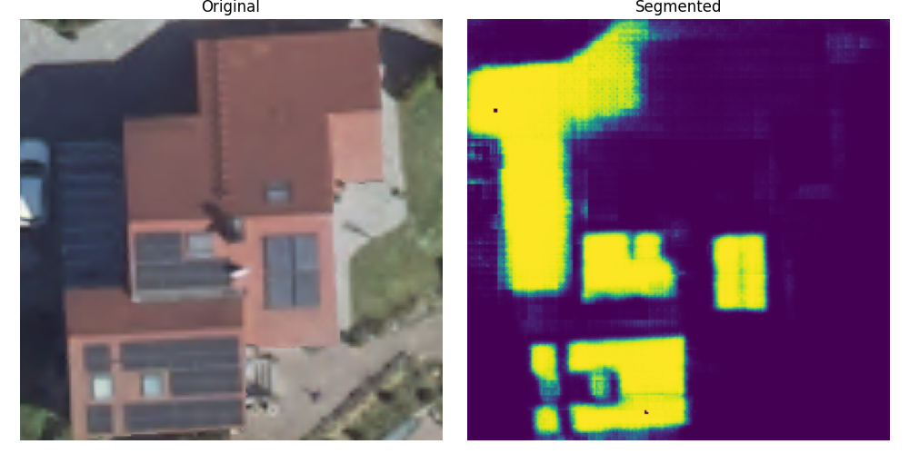

## Recap

In my previous [post](/posts/solar-panel-analysis) I described the usage of segmentation models
to detect roof-mounted solar panels from aerial images. Together with publicly available solar yield
maps the size of solar panels can be used to estimate the annual energy yield (in kWh) for a single
building. This information may be helpful for municipalities or utility companies to understand the energy 
network or to decide upon a location for large battery storage facilities.

While I wanted to extend the approach from one building to villages the [segmentation model](https://github.com/kopytjuk/solar-panel-segmentation) project I used for detection was not performing well:

Although the solar roof array in the lower left was detected quite accurately, there are many false positives — especially in the darker areas of the image. I have several hypotheses explaining why the model’s performance is suboptimal.

The main reason is that the training/test dataset and the images used for inference came from entirely different sources, causing a distribution shift. The training data was taken from publicly available aerial imagery in California, while the inference data came from Germany. Although both datasets consist of aerial images, the geographical differences lead to variations — such as roof colors and solar panel orientations—that can impact model performance. Another difference may be the different imaging equipment and cropping procedures
while creating the training data.

To improve segmentation performance, I explored increasing dataset diversity by incorporating other publicly available datasets and models. In addition, I’d like to share some of the projects I discovered during my research.

## Notable projects

### Multi-Resolution Segmentation of Solar Photovoltaic Systems Using Deep Learning

This project from 2022 is particular interesting, because it was trained on aerial & satellite images of various sizes and regions (Germany, China, France).
The weights of the final model can be downloaded as Torch Model or as [ONNX](https://onnxruntime.ai) Model. 
The model can also be used directly via the Deep Neural Remote Sensing Plugin in QGIS.

Link: https://github.com/Kleebaue/multi-resolution-pv-system-segmentation?tab=readme-ov-file

So far, this is the simplest and most effective off-the-shelf model I’ve come across.

---

### An Efficient AI Workflow for the Detection and Segmentation of Ground-mounted Photovoltaic Systems throughout Bavaria

The 2025 article (in German) presents a clever and computationally efficient procedure for detecting solar panels across large geographical regions and tracking them over time. To date, I consider this approach state-of-the-art.

The approach, which first processes coarse DOP100 (100 cm per pixel) images and then selectively applies DOP20 tiles, significantly increases efficiency by only processing relevant areas in high resolution. Initial tests in three Bavarian counties indicate high accuracy for both AI models. Both U-Net and YOLO were used to identify and segment PV installations. 

Link: https://geodaesie.info/zfv/zfv-archiv/zfv-150-jahrgang/zfv-2025-2/ein-effizienter-ki-workflow-zur-detektion-und-segmentierung-von-freiflaechen-photovoltaikanlagen-in-ganz-bayern

## Datasets

In case someone wants to train a model from scratch, you may find some of the datasets interesting:

### H-RPVS Dataset – Rooftop Photovoltaic System Segmentation

**Year:** 2023

**Summary:**

* Dataset for **segmentation of small-scale rooftop PV systems** from **very high-resolution imagery**.
* Includes **5,866 paired images** from **Heilbronn, Germany**, at **0.15 m** resolution
* Collected via **Google Earth**.

**Resources:**

* [📄 Paper](https://www.mdpi.com/2072-4292/15/21/5232)
* [💻 Code & Data](https://github.com/RS-Wangjx/H-RPVS-Dataset)

A note on the H-RPVS dataset: the files are hosted on Baidu, a Chinese file-sharing service. Downloading them from outside China typically requires paid third-party services. Feel free to contact me if you need guidance.

---

### Distributed Solar Photovoltaic Array Location and Extent Dataset for Remote Sensing Object Identification

**Year:** 2016

**Summary:**

* Contains **9,000 solar panels** mapped across **601 high-resolution (30 cm)** images.
* Data sourced from **four cities in California**.

**Resources:**

* [📄 Paper](https://www.nature.com/articles/sdata2016106)
* [📦 Dataset](https://figshare.com/articles/dataset/Distributed_Solar_Photovoltaic_Array_Location_and_Extent_Data_Set_for_Remote_Sensing_Object_Identification/3385780)

---

### Multi-Resolution Dataset for Photovoltaic Panel Segmentation from Satellite and Aerial Imagery

**Year:** 2021

**Summary:**

* Three PV sample groups from **Chinese villages**, collected at multiple resolutions:

  * **PV08** → 0.8 m (Gaofen-2 & Beijing-2 imagery)
  * **PV03** → 0.3 m (aerial photography)
  * **PV01** → 0.1 m (UAV orthophotos)

**Resources:**

* [📄 Paper](https://essd.copernicus.org/articles/13/5389/2021/)
* [📦 Dataset](https://zenodo.org/records/5171712)

---

### A Harmonised, High-Coverage, Open Dataset of Solar Photovoltaic Installations in the UK

**Year:** 2020

**Summary:**

* Covers **260,000+ PV installations** across the UK.
* Mapped using **freely available aerial imagery** (primarily Bing, which varies in quality).
* Volunteers traced installations in **OpenStreetMap**.

**Resources:**

* [📄 Paper](https://www.nature.com/articles/s41597-020-00739-0)
* [💻 Code & Data](https://github.com/openclimatefix/solar-power-mapping-data)

---

### Crowdsourced Dataset of Aerial Images with Annotated Solar Photovoltaic Arrays and Metadata

**Year:** 2022

**Summary:**

* Installation metadata for **28,000+ PV installations**.
* **13,000** have ground-truth segmentation masks, including **7,000** annotated from **two different image providers**.

**Resources:**

* [📄 Paper](https://www.nature.com/articles/s41597-023-01951-4)
* [📦 Dataset](https://zenodo.org/records/7358126)
