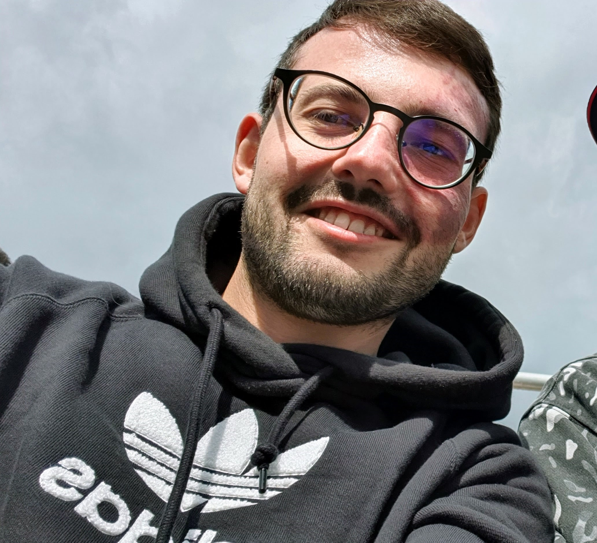

# Marat Kopytjuk

# About me

Hello world!

My name is Marat, I am in my late 20s, work and live in Southern Germany. I was born in Belarus, got my mechatronics degree in Germany. My mother language is Russian, but over the time the available vocabulary in German and English got more advanced.

I count myself as an interdisciplinary developer who believes that combining cross-domain expertise in mechatronical systems, robotics, software engineering, cloud and data science is essential towards inspiring, efficient, future-proof and reliable products.

I heavily use Python and [NumFocus](https://numfocus.org/sponsored-projects) stack (e.g. `numpy` and `bokeh`) for my professional and hobby projects.

## Blog posts

<ul>
  
    <li>
      <a href="{{ site.baseurl }}{{ post.url }}">{{ post.title }} ({{ post.date  | date: '%Y' }})</a>
    </li>
  

  <li>
    <a href="https://medium.com/@kopytjuk/from-c-to-machine-code-demystifying-cpu-mechanics-e5d4cf967e8?sk=351151efbfd3ecce1521e98eb692df4b">From C to machine code — demystifying CPU mechanics (Medium, 2019)</a>
  </li>

  <li>
    <a href="https://towardsdatascience.com/on-simulating-non-linear-dynamic-systems-with-python-or-how-to-gain-insights-without-using-ml-353eebf8dcc3?sk=80b7eca673715025627ab7f3612e9259">On simulating non-linear dynamic systems with Python or how to gain insights without using ML (Medium, 2019)</a>
  </li>

  <li>
    <a href="https://medium.com/analytics-vidhya/on-understanding-of-central-limit-theorem-visually-f70f9b0c02dc">On Understanding of Central Limit Theorem (visually) (Medium, 2019)</a>
  </li>

  <li>
    <a href="https://medium.com/analytics-vidhya/sum-of-two-random-variables-or-the-rocky-path-to-understanding-convolutions-of-probability-b0fc29aca3b5">Sum of two random variables or the rocky path to understanding convolutions of probability distributions (Medium, 2019)</a>
  </li>
</ul>

## Portfolio

My previous experiences which shaped my horizon:

- Vector control implementation in C on ARM Cortex-M3 for brushless DC electric motors (2016)
- Sensor simulation (virtual sensors) for combustion engines with recurrent neural networks, e.g. [`GRU`](https://www.tensorflow.org/api_docs/python/tf/keras/layers/GRU) (2017)
- Algorithm design and spatio-temporal data analysis with [Apache Spark](https://spark.apache.org/) for connected vehicles (2018-now)
- KPI Reporting with [Dash](https://plotly.com/dash/) (interactive) and [Jinja](https://jinja.palletsprojects.com/en/3.0.x/) (static) (2018-now)
- Data engineering with [Azure Batch](https://azure.microsoft.com/en-us/services/batch/) and ML workflow management with [Azure ML](https://azure.microsoft.com/en-us/services/machine-learning/) (2018-now)
- Gitlab CI/CD pipelines involing Docker and `pytest` (2018-now)
- [Frenét-frame trajectory planner](https://ieeexplore.ieee.org/document/5509799?arnumber=5509799) integration from `MATLAB` to ROS2 in C++ (2020)
- Wrapping C++ routines to use in Python with [`pybind11`](https://github.com/pybind/pybind11) (2021)
- Small open source contributions to `opencv`, `tensorflow`, `matplotlib` and `bokeh` (2018-now)
